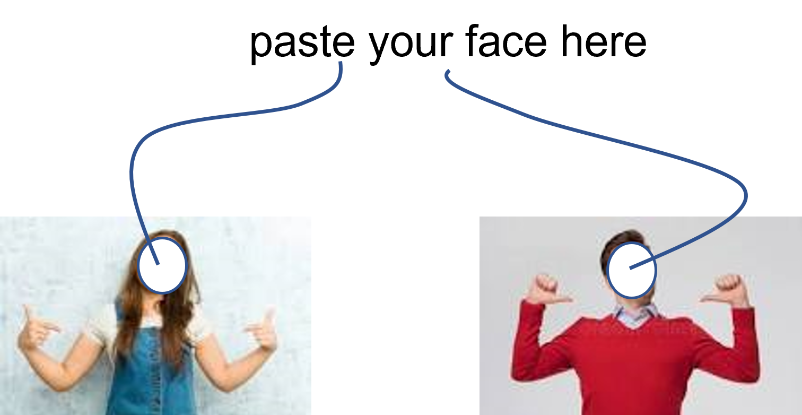

```{r setup, include = FALSE}
library(learnr)
library(gradethis)
library(igraph, verbose = FALSE, quietly = TRUE)

tutorial_options(exercise.checker = gradethis::grade_learnr)
knitr::opts_chunk$set(
	echo = FALSE,
	message = FALSE,
	warning = FALSE,
	cache = FALSE
)

source("../R/helper_code.R")

# Check whether required packages are installed
pkgs <- matrix(c(
  "learnr", "0.11.5", "CRAN",
  "gradethis", "0.2.14", "rstudio/gradethis",
  "igraph", "2.0.3", "CRAN",
  "knitr", "1.48", "CRAN",
  "sna", "2.7", "CRAN",
  "snafun", "0.2024.2", "SNAnalyst/snafun",
  "SNA4DSData", "0.9.93", "SNAnalyst/SNA4DSData",
  "network", "1.18.2", "CRAN"
), byrow = TRUE, ncol = 3) |> 
  as.data.frame() |> 
  setNames(c("pkg", "version", "where"))

check_pkgs <- function(.pkgs = pkgs) {
  sna4tutti:::check_packages(.pkgs)
}

# RStudio
check_RStudio <- function() {
  sna4tutti::check_rstudio_equal_or_larger(version = "2024.04.2", verdict = TRUE)
}


# R check version (required 4.2.1) -updated Aug 2022
check_R <- function() {
  sna4tutti::check_r_equal_or_larger(version = "4.4.1", verdict = TRUE)
}


errors <- list()
```

```{css, echo = FALSE}
.tip {
  border-radius: 10px;
  padding: 10px;
  border: 2px solid #136CB9;
  background-color: #136CB9;
  background-color: rgba(19, 108, 185, 0.1);
  color: #2C5577;
}

.warning {
  border-radius: 10px;
  padding: 10px;
  border: 2px solid #f3e2c4;
  background-color: #f3e2c4;
  background-color: rgba(243, 226, 196, 0.1);
  color: #775418;
}

.infobox {
  border-radius: 10px;
  padding: 10px;
  border: 2px solid #868e96;
  background-color: #868e96;
  background-color: rgba(134, 142, 150, 0.1);
  color: #2F4F4F;
}

# # create a horizontal scroll bar when code is too wide
# pre, code {white-space:pre !important; overflow-x:auto}
```

```{html, echo = FALSE}
<style>
pre {
  white-space: pre-wrap;
  background: #F5F5F5;
  max-width: 100%;
  overflow-x: auto;
}
</style>
```

```{css, echo = FALSE}
.red {
  color: #FF0000;
}

.green {
  color: green;
}

.orange {
  color: orange;
}

.emphasized {
  font-size: 1.2em;
  color: #FF6000;
}
```

## Introduction

In the previous tutorial, you learned the basics of using R. That tutorial was
meant to introduce you to R as a programming language. It is very useful to know
how to use R--not just for network analysis-- because it offers an extremely
powerful programming experience.

Now, it is time to start pointing your freshly developed R power at the analysis
of networks. No worries, we will start gently and will slowly become **quite
advanced** as this course advances.

The purpose of this tutorial is:

-   introduce you to the ecosystem of packages in R that are meant to do network
    analysis (and outside of R too);
-   to be you able at working with the two types of network objects that will be
    the core of this course (and of much of social networks analysis projects by
    researchers worldwide);
-   to introduce you to out awesome course ***CHEATSHEET*** that will prove to
    be of tremendous help to you in this course (and in your later SNA
    projects).

*Let's get to it!*

## Checking installation

First, let's make sure you have all of the required packages installed.

### R Version

You need to have installed R version 4.2.0 and this tutorial is going to check
it for you. Please hit the `Run Code` button.

```{r r_check, echo = TRUE, include = TRUE, exercise = TRUE}
check_R()
```

### R Studio Version

You need to have installed RStudio version 2022.02.3+492 or above. Let's check
by clicking `Run Code`:

```{r rstudio_check, echo = TRUE, include = TRUE, exercise = TRUE}
check_RStudio()
```

### Packages

You need to have a few packages installed. Click the `Run Code` to check. It
will check whether you have the required packages installed and will attempt to
install any missing packages in case there are any (or it will advise you to
upgrade `sna4tutti`).

```{r package_check, echo = TRUE, include = TRUE, exercise = TRUE}

check_pkgs()

```

## What is a network?

Run this code and see what happens (you'll learn about what the code does
exactly later in the course):

```{r load_flobus, echo = FALSE}
data(florentine, package = "snafun")
flobus <- florentine$flobusiness
```

```{r test_load_flobus, results = 'markup'}
data(florentine, package = "snafun")
flobus <- florentine$flobusiness

if (snafun::count_vertices(flobus) != 16) {
  broken_info()
  error <- knitr::opts_current$get(name = "label")
  errors <- base::append(errors, error)
}
```

```{r flobus_exc,  include = TRUE, exercise = TRUE}
data(florentine, package = "snafun")
flobus <- florentine$flobusiness
snafun::plot(flobus)
```

This is a network of 16 families who do business with each other. There are 15
business relations between them.

In order to make sure we all speak the same language in this course. Here are a
few quick definitions.

A network == a graph == a collection of vertices with the edges that connect
them.

Yeah yeah, that still sounds like gibberish. What are vertices and edges?

Vertex = a node / an actor = a dot in the network plot. In this network, there
are sixteen families that the network is about. So, there are 16 vertices. We
will use the term vertex/node/actor interchangeably in this course.

Edge = a tie / a connection / a relation(ship). Here, there are 15 pairs of
families who do business with each other. So, there are 15 edges. We will use
the terms edge/connection/relation/tie interchangeably.

So, a network is simply a set of actors and the relations between them.

Done.

## Using R for Social Network Analysis

Let's start with the good news: the `r rproj()` language is ***BY FAR*** the
most powerful and extensive environment for network analysis. And when I say BY
FAR, I really mean BY FAR. Sure, there are other languages that have capablity
for network analysis, some even have pretty decent packages. And there are many
dedicated software programs for SNA, many commercial with great looking user
interfaces. But they still don't get even close to how powerful the ecosystem of
`r rproj()` is for network analysis.

By immersing yourself in `r rproj()` , you will become well-versed in the best
tool for the job. No, let me rephrase that: ***BY FAR*** the best tool for the
job!

{width="322"}

::: credit
(Photo by [Greg Rosenke](https://unsplash.com/@greg_rosenke) on
[Unsplash](https://unsplash.com/s/photos/tool))
:::

<!-- <p style="font-size:0.4rem; font-style:italic; text-align:right"> -->

<!-- (Photo by [Greg Rosenke](https://unsplash.com/@greg_rosenke) on -->

<!-- [Unsplash](https://unsplash.com/s/photos/tool)) -->

<!-- </p> -->

### SNA outside of `r rproj()`

Network analysis is hip. And very useful, for example for organizations. That is
why there are so many software programs and tools for SNA in the world. Most
languages have some facility for network analysis. Even Excel... Yep, complete
with a fancy [website](https://www.smrfoundation.org/ "NodeXL"). Why anyone
would want to perform SNA in an environment like Excel is beyond me, but people
do it. Mainly in businesses.

Then there are the "serious" languages/programming environments like Matlab,
Mathematica, or Python. These also have tools for network analysis. In Python,
the main libraries are [igraph](https://igraph.org/python/ "igraph in python")
and [NetworkX](https://networkx.org/ "networkX in python"). The `igraph` library
is actually a variation of the `igraph` package that we will be using in this
course. The NetworkX library is written in pure Python, so it is a bit slow. It
is a decent package, but too limited for the purpose of our course. That said,
once you have mastered the fundamentals of SNA in our course (esp. what we
discuss in the first couple of weeks in the course) you can do some decent
descriptive analysis in NetworkX or Python igraph too.

Then, there are many standalone softwares for SNA. Think of
[Pajek/PajekXXl/Pajex3XL](http://mrvar.fdv.uni-lj.si/pajek/ "Pajek"),
[Gephi](https://gephi.org/ "Gephi"),
[Cytoscape](https://cytoscape.org/ "Cytoscape"),
[GraphStream](https://graphstream-project.org/ "GraphStream"),
[NetMiner](http://www.netminer.com/ "NetMiner"), or (for historical reasons)
[Visone](https://visone.ethz.ch/html/about.html "Visone"). There are dozens
more. These are all free.

And then there are dozens more that are commercial.

If you wanted, you could analyze your social network data in a different
language/package/library/software/tool every day if the year without going to
the same one twice.

### SNA using `r rproj()`

You can do a lot with the tools mentioned above, but no single environment is as
powerful in network analysis as R. Especially when it comes to statistical
analysis of social networks, R is absolutely unparalleled. This is because the
academic community who are advancing the field of statistical analysis of social
networks program their tools in R and make those available to the rest of world
that way. This actually goes beyond *social* networks, there is also a huge
community in the natural sciences doing analysis (e.g. of biological networks),
making their tools available through R for the rest of us.

This leads us to some good news and some bad news.

::: {.green style="font-size: large;"}
The good news first
:::

<br>

In `r rproj()` you can do virtually any analysis you want to perform on
networked data. Especially when it comes to modeling networks, `r rproj()` is
virtually unparalleled. Sure, you can do some of the stuff in other programs
too, but lots of modeling methods have been implemented in `r rproj()` only. The
wonderful thing is that you can run an entire network analysis pipeline inside
`r rproj()` alone.

::: {.red style="font-size: large;"}
Then the bad news
:::

<br>

The fact that `r rproj()` is so incredibly powerful is due to tens of thousands
of researchers implementing their models and techniques into `r rproj()`
packages. The result is that the capability of doing network analysis in
`r rproj()` is scattered across hundreds of dedicated packages. These packages
were developed by many different researchers and many different research groups
and often work (slightly/very) different from other network analysis packages
inside `r rproj()`. This means that a network analysis pipeline often requires
an analyst to use multiple packages that each require specific input data
structures and spit out specific output data structures. This is not consistent.
The result is that you will need to convert your input and output objects
multiple times during a network analysis pipeline to perform the full analysis
you wanted using the various packages. Note that function naming is also often
not consistent between packages. Or argument naming. So, beware, and always
consult the help pages of a package you haven't worked with before (or in a
while).

This, in fact, is a challenge across the `r rproj()` ecosystem, it is not
specific to network analysis in `r rproj()`. It (partly) derives from the adage
that many `r rproj()` users live by: create packages that do a single group of
things really well, rather than creating large packages that try to do it all
(and then possibly not all as well).

::: {.orange style="font-size: large;"}
Some better news
:::

<br>

Although there are many packages that each specialize in a specific analysis
method, there are two packages that have set a standard that many other packages
can work with.

**The first is `igraph`.** The `igraph` package actually has implementations in
C/C++, Python, Mathematica, and R. Although the `igraph` functions are slightly
different between these environments, you will benefit from the code in this
course if you want to use `igraph` in another environment at a later time.

The general `igraph` page is [here](https://igraph.org/) and the extended
documentation for the R version is [here](https://igraph.org/r/#docs).

The `igraph` package is very capable for descriptive and mathematical analysis
of network data. The package works with objects of class `igraph` (you already
learnt that `r rproj()` is an object-oriented functional language, which means
that **everything** in `r rproj()` is an object--even functions). This type of
object can also be used by other packages, such as
[`tidygraph`](https://cran.r-project.org/web/packages/tidygraph/index.html "tidygraph")
or
[`migraph`](https://cran.rstudio.com/web/packages/migraph/index.html "migraph").
We will make considerable use of the `igraph` infrastructure throughout this
course, especially in the first weeks.

**The second is the (creatively named) `network` package.** This
[package](https://cran.rstudio.com/web/packages/network/index.html "network")
implements a class of *network* objects that can be analyzed by packages such as
the [`sna`](https://cran.rstudio.com/web/packages/sna/index.html "sna") package
you already used in this tutorial.

Actually, `sna` and `network` are part of the
[statnet](https://statnet.org/ "stanet website") suite of packages, that all
work together). We will make use of this set of packages a lot in this course
(especially in the second part of the course). Actually, the packages inside the
[statnet](https://statnet.org/ "stanet website") suite are mutually somewhat
inconsistent in that they sometimes require objects of class *network* as input
and at other times expect a *matrix* instead (even within the same package, such
as the `sna` package).

*So, where is that somewhat better news you promised me?*

Well, with these types of data structure, you can do most of the analyses you
will encounter in this course and that you will need in most network analysis
projects.

So, although you will still need to convert your network data between these
three structures (*network*, *matrix*, and *igraph*), in most projects you will
not have to deal with other data structures as well.

::: {.green style="font-size: large;"}
All is well that ends well
:::

<br>

OK, so you learnt that there are three data structures that you will need to
convert between and that you will have to switch between several packages (esp.
`network`/`sna` and `igraph`) as part of the analysis of network data. That's a
bit painful and annoying and distracts from focusing on the fun of network
analysis itself.

> Claudia and Roger to the rescue!


We have created a package called `snafun` especially for you, for use in this
course and beyond. The package works seamlessly with objects of class `network`
and `igraph` . It will convert between these classes (and several others as
well) and even offers you the ability to run analyses without bothering about
which of these data types you are using. It simply works. So, if you run
`snafun::betweenness(x)`, this will work regardless of whether ˋx\` has class
`network` or `igraph` . The package also enables you to run an analysis that is
only available in one of these packages while using the object of the other
class. It still simply works. And it works simply, too ;-)

Of course, we have not implemented every possible tool and method for you, but
you will be able to do most of the things from the first part of the course in
`snafun` mostly. And then, when we get to modeling networks using Exponential
Random Graph Models (part II of the course), you simply use \`snafun\` to
convert your data to the `network` data structure and off you go.

*You could say that `snafun` enhances the fun of sna.*

**What an amazingly appropriate name for a package!**

### The `snafun` API

We have tried to use a consistent API for the `snafun` package. The package is
very recent (we developed it over the last few months), so there may be some
space for further development and extension. But this is the general idea behind
the API. This is what it looks like:

-   add\_\* : add stuff to network objects
-   count\_\* : counting things in the graph, such as the number of vertices,
    number of edges, dyad census, triad census
-   create\_\* : create graphs (in igraph or network format) with specific
    characteristics
-   extract\_\* : access specific data from (network) objects
-   is\_\* : checks, such as whether a network is bipartite
-   has\_\* : checks, such as whether a network has loops
-   list\_\*: list characteristics, such as list_edge_attributes
-   make\_\* : create objects based on graphs, ie. make a matrix from vertex
    attributes, make a mixing_matrix, etc.
-   plot\_\* : several plot functions
-   remove\_\* : delete parts of the network, such as remove the isolates
-   stat\_\* : help functions for statistical modeling
-   to\_\* : conversion methods, converting from igraph, network, matrix,
    data.frame to igraph, network, matrix, data.frame

Then, there are indices/measures at three levels: - e\_\* : edge level indices -
g\_\* : graph level indices, such as betweenness centralization - v\_\* : vertex
level indices, such as betweenness.

Finally, it is inevitable to have a few some functions that don't fit within a
clear category and don't follow this API.

Anyway, try to remember the API above, so you can easily find the functions you
need. We also have an extensive website for the package, with access to all the
help files and cheatsheets (under "Articles"): [SNAFUN
website](https://snanalyst.github.io/SNAfun/ "SNAFUN website").

***ENJOY!!!***

{width="681"}

## Exploring network data

Let's explore what network data look like and how you figure out what's inside a
data object. We start by loading data from the \` package. Loading data from a
package always works the same way in R. This is what you do:

```{r emon_load, echo = FALSE}
data(emon, package = "network")
cheyenne <- emon$Cheyenne
cheyenne_i <- snafun::to_igraph(emon$Cheyenne)
texas <- emon$Texas
texas_i <- snafun::to_igraph(texas)
new_names <- c("USArmy", "DisES", "HwPtl", "NatGrd", "Parks", "HwDpt", 
               "Rngr", "RdCrs", "EMS", "SlvArm", "KnCCD", "KnCSO", "CoVFD",
               "KrCSO", "KrCCD", "CeVFD", "ISVFD", "KSVFD", "KFD", "KPD",
               "RctK", "BCSO", "BCCD", "BVFD", "PCVFD")
texas2 <- snafun::add_vertex_attributes(texas, "vertex.names", new_names)
```

```{r test_emon_load1, results = 'markup'}
data(emon, package = "network")
cheyenne <- emon$Cheyenne

if (snafun::count_vertices(cheyenne) != 14) {
  broken_info()
  error <- knitr::opts_current$get(name = "label")
  errors <- base::append(errors, error)
}
```

```{r test_emon_load2, results = 'markup'}
data(emon, package = "network")
cheyenne <- emon$Cheyenne
cheyenne_i <- snafun::to_igraph(cheyenne)

if (snafun::count_vertices(cheyenne_i) != 14) {
  broken_info()
  error <- knitr::opts_current$get(name = "label")
  errors <- base::append(errors, error)
}
```

```{r test_emon_load3, results = 'markup'}
data(emon, package = "network")
texas <- emon$Texas

if (snafun::count_vertices(texas) != 25) {
  broken_info()
  error <- knitr::opts_current$get(name = "label")
  errors <- base::append(errors, error)
}
```

```{r test_emon_load4, results = 'markup'}
data(emon, package = "network")
texas_i <- snafun::to_igraph(emon$Texas)

if (snafun::count_vertices(texas_i) != 25) {
  broken_info()
  error <- knitr::opts_current$get(name = "label")
  errors <- base::append(errors, error)
}
```

```{r emon_load_exc1,  include = TRUE, exercise = TRUE}
data(emon, package = "network")
```

If you want to learn more about this dataset, type `?emon` after loading it and
check the help page that pops up. You will then see that `emon` is a list that
contains seven networks. Let's look at the first one, called "Cheyenne". You
still remember from the R tutorial how to access that one, right?

```{r emon_load_exc2,  include = TRUE, exercise = TRUE,  exercise.setup = "emon_load"}
data(emon, package = "network")
cheyenne <- emon$Cheyenne
```

Let's look at the data object

```{r emon_load_exc3,  include = TRUE, exercise = TRUE,  exercise.setup = "emon_load"}
print(cheyenne)
```

This is what an object of class `network` looks like. This is a network with 14
vertices that are connected by a total of 83 edges.

You also see that the edges are *directed* (that is: they have a sender and a
receiver), there are no *loops* (a loop is an edge from an actor to himself).
You also see that there are several attributes in the data about the vertices,
such as their *Location*, their *Paid.Staff* and their names (*vertex.names*).
We also have an attribute *Frequency* for the edges. Again, the help file gives
info on what these attributes mean.

This is what a `network` object looks like. Let's look at the same data in a
`igraph` format. How? USE THAT AWESOME PACKAGE YOU LEARNED ABOUT ABOVE!

```{r emon_load_exc3a,  include = TRUE, exercise = TRUE,  exercise.setup = "emon_load"}
cheyenne_i <- snafun::to_igraph(cheyenne)
print(cheyenne_i)
```

That looks different! On the first line you see "14 83" which means: 14 vertices
with 83 edges. You also see the capital D saying: this is a "directed" network.
You also see the attributes that we just saw above. The presentation of the
network data is different because an `igraph` object is very different from a
`network` object, even when both encode the same data.

### Gimme some numbers

It would be silly to have to print the object if you want to know its
characteristics, so you use functions for this. Here's a bunch:

```{r emon_load_exc4_fies,  include = TRUE, exercise = TRUE,  exercise.setup = "emon_load"}
snafun::count_vertices(cheyenne)
snafun::count_edges(cheyenne)
snafun::is_directed(cheyenne)
snafun::is_network(cheyenne)
snafun::is_igraph(cheyenne)
snafun::has_loops(cheyenne)
snafun::list_edge_attributes(cheyenne)
snafun::list_vertex_attributes(cheyenne)
```

That's simple and fun!

Now, here is a little challenge:

-   read in the network called "Texas", that is inside the `emon` data

-   apply the functions from above on the Texas network instead of on Cheyenne -
    convert the Texas network to an `igraph` object, call that `texas_i` for
    now.

-   determine all of these numbers for `Texas_i`.

-   Check if you get the same results (you should)

```{r emon_load_exc5_fies, include = TRUE, exercise.lines = 20, exercise = TRUE,  exercise.setup = "emon_load"}

```

```{r emon_load_exc5_fies-hint-1}
texas <- emon$Texas
```

```{r emon_load_exc5_fies-hint-2}
snafun::count_vertices(texas)
snafun::count_edges(texas)
snafun::is_directed(texas)
```

```{r emon_load_exc5_fies-hint-3}
texas_i <- snafun::to_igraph(texas)
```

```{r emon_load_exc5_fies-hint-4}
snafun::is_network(texas_i)
snafun::is_igraph(texas_i)
snafun::has_loops(texas_i)
snafun::list_edge_attributes(texas_i)
snafun::list_vertex_attributes(texas_i)
```

```{r emon_load_exc5_fies-solution}
texas <- emon$Texas
snafun::count_vertices(texas)
snafun::count_edges(texas)
snafun::is_directed(texas)
snafun::is_network(texas)
snafun::is_igraph(texas)
snafun::has_loops(texas)
snafun::list_edge_attributes(texas)
snafun::list_vertex_attributes(texas)

texas_i <- snafun::to_igraph(texas)
snafun::count_vertices(texas_i)
snafun::count_edges(texas_i)
snafun::is_directed(texas_i)
snafun::is_network(texas_i)
snafun::is_igraph(texas_i)
snafun::has_loops(texas_i)
snafun::list_edge_attributes(texas_i)
snafun::list_vertex_attributes(texas_i)
```

By now, you should be getting a good idea of how you can get a feel for the
network data you are working with.

> Did you notice that the `snafun` functions are exactly the same, regardless of
> whether you feed it an `igraph` object or a `network` object? That's the power
> of `snafun`: it just understands what to do. BRILLIANT!

(and isn't it wonderful that we remain so humble and modest about it?)

### Gimme more data from the object!

Let's extract some of the attributes from the network objects. This is the
format:

``` r
# get the vertex attribute that is called "Formalization"
snafun::extract_vertex_attribute(texas, "Formalization")

# there is only 1 edge attribute, get it
snafun::extract_edge_attribute(texas, "Frequency")
```

Try it out. Extract some attributes from the `texas_i` graph (so, the `igraph`
object). Get hold of at least two vertex attributes and get the edge attribute.
Feel free to ask for an attribute that doesn't occur in the graph object and
check out what `snafun` returns in this case.

```{r texas_attrs, include = TRUE, exercise.lines = 5, exercise = TRUE,  exercise.setup = "emon_load"}

```

```{r texas_attrs-hint-1}
snafun::extract_vertex_attribute(texas_i, "Volunteer.Staff")
```

```{r texas_attrs-hint-2}
snafun::extract_edge_attribute(texas_i, "Frequency")
```

```{r texas_attrs-solution}
snafun::extract_vertex_attribute(texas_i, "Volunteer.Staff")
snafun::extract_vertex_attribute(texas_i, "Command.Rank.Score")
snafun::extract_edge_attribute(texas_i, "Frequency")
snafun::extract_edge_attribute(texas_i, "Frequency2") # does not exist
```

The `igraph` and `network` objects give different names to the vertex attribute
that contains the names of the actors. Look at the help for the
`snafun::extract` function and then find out how you can access the names of the
actors in the `texas` and `texas_i` graph objects.

```{r texas_names, include = TRUE, exercise.lines = 5, exercise = TRUE,  exercise.setup = "emon_load"}

```

```{r texas_names-hint-1}
# look at the help for the `extract` function 
?snafun::extract
```

```{r texas_names-hint-2}
# which vertex attributes are there in texas?
snafun::list_vertex_attributes(texas)

# get the vertex names in two ways
snafun::extract_vertex_attribute(texas, "vertex.names")
snafun::extract_vertex_names(texas)
```

```{r texas_names-hint-3}
# the attribute with the vertex names has a different name in `texas_i` 
snafun::list_vertex_attributes(texas_i)
```

```{r texas_names-solution}
# note that igraph and network name the vertex name attribute differently
# but the snafun::extract_vertex_names function takes care of this automatically
snafun::extract_vertex_attribute(texas, "vertex.names")
snafun::extract_vertex_attribute(texas_i, "name")
snafun::extract_vertex_names(texas)
snafun::extract_vertex_names(texas_i)
```

Later, we will make extensive use of a very handy function that extracts all of
the vertex attributes at once and puts all of them together in a data.frame.

Try it out (feel free to try it for both `texas` and `texas_i`--the output is
ordered slightly differently, but the data are the same):

```{r texas_attrs2, include = TRUE, exercise.lines = 5, exercise = TRUE,  exercise.setup = "emon_load"}
snafun::extract_all_vertex_attributes(texas)
```

## Basic network representations

We have now seen that there are multiple graph objects in R and that we will
focus mainly on `igraph` and `network` objects.

But there are also other ways to represent a network. These representations are
canonical and independent of the R environment. These are representations you
will encounter a lot in network analysis. Let's discuss the three main ones.

We'll do this with the network we already saw: the `flobus` network. Recall that
this is what it looks like:

```{r flobus_plot, echo = FALSE, eval = TRUE}
snafun::plot(flobus)
```

#### Adjacency matrix

An *adjacency matrix* is a matrix in which the rows and columns represent
different nodes. In an unweighted adjacency matrix, the edges (i.e., lines) are
0 or 1, indicating whether these two nodes are connected. If two nodes are
connected, they are said to be *adjacent* (hence the name, *adjacency matrix*).
In a weighted matrix, however, the cells can have different values, indicating
different edge qualities (or tie strengths).

For this network, the adjacency matrix looks as follows

```{r flobus_adjm, exercise = TRUE, exercise.setup = "load_flobus"}
snafun::to_matrix(flobus)
```

[Did you notice the function we used here?]

When the network is undirected and unweighted, the corresponding adjacency
matrix is symmetrical and binary, as is the case here.

### Edge List

A very common data structure is the *edge list*. An edge list is a two-column
matrix, with the sender in the first column and the receiver in the second (ie.
the edge goes from the vertex in the first column to the vertex in the second
column). In an undirected network, the order of the vertices don't matter. For
weighted networks, you may have a third column that indicates the edge weight.

```{r flobus_el, exercise = TRUE, exercise.setup = "load_flobus"}
snafun::to_edgelist(flobus)
```

Compare with the graph to understand the exact structure of the edge list.

In case there would be edge attributes, these would go as additional columns in
this data.frame. Here, there are none.

### Adjacency List

An *adjacency list* (or *node list*, is a list that presents the 'focal' node
and then all the other nodes that are connected to it (i.e., that are "adjacent"
to it). This looks as follows:

```{r flobus_adjlist, exercise = TRUE, exercise.setup = "load_flobus"}
igraph::as_adj_list(flobus)
```

Compare this with the results above, can you see how this works?

[There is no implementation for this in `snafun` yet. But if you really want to
have it, ask Claudia and Roger nicely and it might just magically be added to
the package!]

## Bipartite networks

We defined a network as a collection of actors and the ties between them. In
many networks, ties can potentially happen between any two actors.

Not so in bipartite networks.

A *bipartite network* (also called a *bimodal* network or a *two-mode network*)
is a network with two **types of nodes**, where edges run only between nodes of
*different* types.

Recommender systems are prominent examples of bipartite networks, where people
are connected to books or music or movies or so and the edges measure "liking"
or "purchasing." But books don't purchase other books and customers don't
purchase other customers. So, edges run between customers and books, but not
between books and not between customers. So, the ties only occur between nodes
of different types, but not between nodes of the same type.

Or consider a network of researchers and the academic papers they write. Or
students and the classes they take. Or movie stars and the movies they play in.
Or directors and the boards of directors they are a member of. Keywords and the
pages they appear in. Trains and the stations they visit. Metabolites and the
biological reaction they participate in.

You get the idea.

They are actually quite common.

You learnt about the adjacency matrix for a unimodal network. The equivalent of
the adjacency matrix for an (undirected unweighted) bipartite network is a
rectangular matrix called the **incidence matrix**. If *n* is the number of
items or people in the network and *g* is the number of
groups/movies/books/train stations, then the incidence matrix *B* is the *g × n*
matrix where cell (*i*, *j*) is 1 if item *j* belongs to group *i*, and 0
otherwise.

Let's try it out.

Load the `judge_net_bp` network from the `SNA4DSData` package. This is a network
of judges and the cases they worked on.

First, get the dataset from the `SNA4DSData` package and then print it.

```{r load_bp, echo = FALSE}
data(judge_net_bp, package = "SNA4DSData")
judges <- judge_net_bp
im <- snafun::to_matrix(judges)
```

```{r test_load_bp, results = 'markup'}
data(judge_net_bp, package = "SNA4DSData")
judges <- judge_net_bp
im <- snafun::to_matrix(judges)

if (!snafun::is_bipartite(judges)) {
  broken_info()
  error <- knitr::opts_current$get(name = "label")
  errors <- base::append(errors, error)
}
```

```{r test_load_bp2, results = 'markup'}
data(judge_net_bp, package = "SNA4DSData")
judges <- judge_net_bp
im <- snafun::to_matrix(judges)

if (!is.matrix(im)) {
  broken_info()
  error <- knitr::opts_current$get(name = "label")
  errors <- base::append(errors, error)
}
```

```{r test_load_bp3, results = 'markup'}
data(judge_net_bp, package = "SNA4DSData")
judges <- judge_net_bp
im <- snafun::to_matrix(judges)

if (isSymmetric(im)) {
  broken_info()
  error <- knitr::opts_current$get(name = "label")
  errors <- base::append(errors, error)
}
```

```{r load_bp_ex, include = TRUE, exercise = TRUE}
data(judge_net_bp, package = "SNA4DSData")
judges <- judge_net_bp
print(judges)
```

You recognize the structure of an `igraph` object. Look at it carefully. and try
to answer this quiz question:

```{r bp_quiz, echo=FALSE}
question("How can you tell from the printout that this is a bipartite network?",
  answer("You can't, you need to examine the object further to see this"),
  answer("It has an attribute called *type*"),
  answer("It shows a 'B' on the first line of the printout", correct = TRUE),
  answer("By the number of edges and vertices"),
  allow_retry = TRUE
)
```

We wanted to see the incidence matrix. The problem is, there are 1189 vertices
in the network (you noted that from the `igraph` output, right?), so it will be
quite large. Still, let's be brave and just go for it. If smoke comes out of our
laptops, we'll just buy a new one later.

You get the incidence matrix for a bipartite network using `snafun::to_matrix`.
Do that now.

```{r bp_incid, exercise = TRUE, exercise.setup = "load_bp"}
cat('Create the incidence matrix for "judges" and call it "im". Then print it.')
```

```{r bp_incid-solution}
im <- snafun::to_matrix(judges)
im
```

OK, that's clearly too big for our screens. Let's look at it a bit further. As
you will recall, an adjacency matrix is square: there are as many potential
senders as receivers, so there are as many rows as columns. That makes a matrix
square.

We will call the incidence matrix *im* for short. Is `im` square? Let's look at
the dimension of `im`.

```{r bp_table0, exercise = TRUE, exercise.setup = "load_bp"}
dim(im)
```

The first number represent the number of rows that `im` has the second number
the number of columns. Well, is it square? Why does it have a lot more rows than
columns? In fact: what is in the rows and what is in the columns?

I think you have figured it out.

One final note. Why did `snafun::to_matrix` create an incidence matrix (ie. a
matrix with vertices of one type as senders and vertices of another type as
receivers), while it gave us an adjacency matrix before? The answer is:

***because*** **`snafun`*is smart***

It understands how `igraph` objects work. That's fun!

## Doing your first analysis

OK, you now know

-   how to check out what is in a graph object
-   how to use functions to find the number of vertices, the number of edges
-   how to use functions to extract attributes of vertices, edges, and graphs
-   how to convert between `igraph` and `network` data and adjacency matrices,
    incidence matrices, edge lists, and adjacency lists.
-   you used your first functions from the `snafun` package

That's already a lot! You can be proud of yourself!

<br><br>

```{r proud_boy_and_girl, fig.align='center', echo = FALSE}

```

<br><br><br><br>

We'll now explore one of the graphs from this tutorial a biut further.

### Making names simpler

Let's continue our work with the texas data. The vertex names are quite long,
which is going to make our output crowded. So, let's simplify the names of the
vertices. I will put the new names in a vector called `new_names`, so you can
see which is which.

```{r names, exercise = TRUE, exercise.setup = "emon_load"}
old_names <- snafun::extract_vertex_names(texas)
new_names <- c("USArmy", "DisES", "HwPtl", "NatGrd", "Parks", "HwDpt", 
               "Rngr", "RdCrs", "EMS", "SlvArm", "KnCCD", "KnCSO", "CoVFD",
               "KrCSO", "KrCCD", "CeVFD", "ISVFD", "KSVFD", "KFD", "KPD",
               "RctK", "BCSO", "BCCD", "BVFD", "PCVFD")
cbind(old_names, new_names)
```

You set the vertex names using your favorite R package. The format is:

``` r
snafun::add_vertex_attributes(x = name_of_the_graph, 
                              attr_name = name_of_the_attribute, 
                              value = value_to_be_used)
```

Like so:

```{r names2, exercise = TRUE, exercise.setup = "emon_load"}
texas2 <- snafun::add_vertex_attributes(x = texas, attr_name = "vertex.names", value = new_names)
```

Although it says `add_vertex_attribute`, you can also use this function to set
an existing attribute to some value. Check it out and extract the vertex names
from `texas2`.

```{r names_t2, exercise = TRUE, exercise.setup = "emon_load", exercise.lines = 2}

```

```{r names_t2-solution}
snafun::extract_vertex_names(texas2)
```

Wonderful, you are getting the hang of it!

Actually, there is a shorter way of doing this, because `snafun` actually has a
specific function to add vertex names:

``` r
texas2 <- snafun::add_vertex_names(x = texas, value = new_names)
```

We recommend that you use this function for vertex names (and the regular
`snafun::add_vertex_attributes` to set any other vertex attribute), because the
`igraph` and `network` objects store vertex names differently. Our specialized
function does it correctly for both graph classes, so you don't have to remember
how they differ exactly. Much easier, and much safer too.

### Distance

Hopefully, you checked out the help for `emon` earlier in this tutorial. There,
you learned that the networks inside `emon` reflect inter-organizational
networks of interaction during search and rescue (SAR) activities. We are
looking at data from Texas: which organization works with which organization
when it comes to search and rescue. The data are directed, so organization A may
seek out organization B to collaborate, but B may not seek out A.

Do note that this is a well-known data set from 1981, so it may not reflect how
search and rescue is conducted today.

Let's make a quick plot. It is going to be ugly, but no worries: you'll learn
how to make nice plots in a few weeks.

```{r texas2_plot, exercise = TRUE, exercise.setup = "emon_load"}
snafun::plot(texas2)
```

Let's say you want to know how many steps it takes from one organization to
another. This is called the *distance* between to vertices and you get it using
the `snafun::d_distance()` function. Check the help for this function and then
apply it to `texas2`, with `mode = "out"`, so you take the direction of the
relationships into account.

```{r texas2_distances, exercise = TRUE, exercise.setup = "emon_load"}

```

```{r texas2_distances-solution}
# to get the help page: `?snafun::d_distance`
snafun::d_distance(texas2, mode = "out")
```

You see that it takes 3 steps to get from the US Army to Kerr County Civil
Defense ("KrCCD"). If you look at the adjacency matrix (or the edge list) (or
the adjacency list), you would see that USArmy -\> Texas Highway Patrol -\>
Kerrville Police Department -\> Kerr County Civil Defense. That's three steps.

(there are alternatives, you can replace "Kerrville Police Department" with
"Comfort Volunteer Fire Department" or "Red Cross" or "Texas National Guard",
but it will never be less than three steps).

You also see that the distance from the Salvation Army to all others is
infinitely large. Why? Because there is not a single tie from the Salvation Army
to any other organization. There are some ties *to* the Salvation Army, so they
are not completely alone.

### Density

Since there are 25 organizations, there could be 25 \* 24 = 600 directed ties in
this network (why? try your math skills on this). But there are only 186 ties.
Because 186/600 = .31, this means that just under one third of all collaborative
ties in this SAR network are present. You could have determined this without
doing the math by hand. See if you can calculate this number using the
`snafun::g_density` function. Check out the help and apply it (we don't want to
consider loops).

```{r texas2_density, exercise = TRUE, exercise.setup = "emon_load"}

```

```{r texas2_density-solution}
# to get the help page: `?snafun::g_density`
snafun::g_density(texas2)
```

Superb job.

Indeed, this measure is called *density* and you'll determine this for every
graph you will encounter from now on.

### Who is in my neighborhood?

The US Army is an important player in any large scale search and rescue
endeavor. We can quickly see whom they are working with, using the
`snafun::extract_neighbors` function. Check out the help and then figure out
which other organizations receive an edge from the US Army in the Texas network.
Also, check out from whom the US Army receives an edge in `texas2`.

```{r texas2_nb, exercise = TRUE, exercise.setup = "emon_load", excercise.lines = 3}

```

```{r texas2_nb-solution}
# to get the help page: `?snafun::extract_neighbors`
# 
# who receive an edge from the US Army?
snafun::extract_neighbors(texas2, vertex = "USArmy", type = "out")

# who send an edge to the US Army?
snafun::extract_neighbors(texas2, vertex = "USArmy", type = "in")
```

What do you conclude: are the US Army popular collaboration partners or do they
have to squeeze themselves in to get some collaboration going?

### Let's summarize

As you learned in the bootcamp, you should always thoroughly inspect your data
before you do any fancy analysis on it. The type of stuff you have done so far
is part of that.

By now, you are probably not surprised to learn that `snafun` once again has an
exquisitely helpful function to provide you with omse of the basic measures in a
single go. It is called, believe it or not: `snafun::g_summary` (because it
provides a summary at the graph level). Fun and easy.

Wouldn't it be wonderful if doing taxes would be as smooth?

Try out `snafun::g_summary` on `texas2` and see if you recognize some of the
output.

```{r texas2_summary, exercise = TRUE, exercise.setup = "emon_load", excercise.lines = 2}

```

```{r texas2_summary-solution}
# to get the help page: `?snafun::g_summary`
snafun::g_summary(texas2)
```

Many of the measures will be new to you, but you'll learn them next week. What
you do know is that dealing with graph objects in `r rproj()` is easy peasy.
That way, you can focus on extracting awesome insights from networked data.

Exciting!

```{r isolates_quiz, echo=FALSE}
question("Isolates are nodes that are unconnected to others. How many of those are there in this network?",
  answer(0, correct = TRUE),
  answer(1),
  answer(171),
  answer(414),
  allow_retry = TRUE,
  correct = "Really great job, I am very proud of you!"
)
```

## It's a wrap!

There you go. You learnt about the various graph objects in `r rproj()` and the
various representations of network structures. You manipulated graph objects
(accessing attributes, setting attributes, figuring out the vertices and the
edges), you dabbled with bipartite networks and even computed some measures on
the networks and the dyads.

This is only the necessary foundation, so that we can start doing some actual
analyses of social networks. You need to have ***mastered the foundations*** of
how to deal with this type of data before you can start doing cool stuff with
them.

| [Foundation!](https://www.politico.com/states/new-york/city-hall/story/2015/12/minority-workers-sue-operating-engineers-union-028979) | [Foundation!](https://www.pexels.com/photo/black-woman-spreading-foundation-on-face-with-brush-6954108/) |
|:--------------------------------------:|:--------------------------------------:|
|                                           {width="100%"}                                           |                    {width="87%"}                     |

You are now ready to try some of this stuff on your own. Please do the homeplay
(see Canvas), which will be the foundation for the upcoming lab.

It's going to go faster from here and we'll be more adventurous in every future
tutorial and lab and you now have the skills to travel along.

ENJOY the ride!

<br><br><br>

```{r, fig.align='center', echo = FALSE}
knitr::include_graphics("images/roadtrip.gif")
```

<br><br><br>

```{r check_results_external, echo=FALSE, child = if (length(errors) > 0) "check_results.Rmd"}
```
