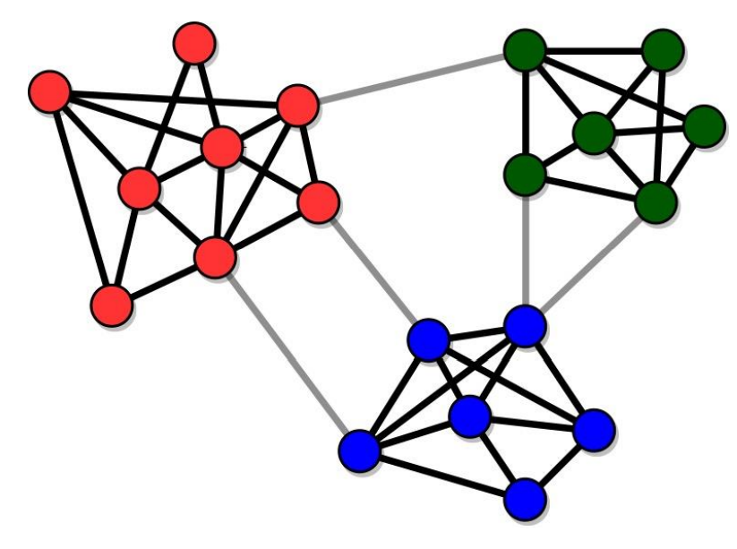

```{r setup, include = FALSE}
library(learnr)
library(gradethis)
# library(magrittr)
tutorial_options(exercise.checker = gradethis::grade_learnr)
knitr::opts_chunk$set(
	echo = FALSE,
	message = FALSE,
	warning = FALSE,
	cache = FALSE
)

source("../R/helper_code.R")

# Check whether required packages are installed
pkgs <- matrix(c(
  "learnr", "0.10.2", "CRAN",
  "gradethis", "0.2.8.9000", "rstudio/gradethis",
  "igraph", "1.3.2", "CRAN",
  "igraphdata", "1.0.0", "CRAN",
  "sna", "2.7", "CRAN",
  "SNA4DSData", "0.9.91", "SNAnalyst/SNA4DSData",
  "network", "1.17.1", "CRAN"
), byrow = TRUE, ncol = 3) |> 
  as.data.frame() |> 
  setNames(c("pkg", "version", "where"))


check_pkgs <- function(.pkgs = pkgs) {
  out <- try(sna4tutti:::check_packages(.pkgs))
  if (inherits(out, "try-error")) {
    if (grepl("argument is of length zero", out)) {
      cat("\n\n>>>Please update 'snaverse' including all of its dependencies<<<\n\n")
    }
  }
}

# RStudio
check_RStudio <- function() {
  sna4tutti::check_rstudio_equal_or_larger(version = "2022.7.1.554", verdict = TRUE)
}


# R check version (required 4.2.1) -updated Aug 2022
check_R <- function() {
  sna4tutti::check_r_equal_or_larger(version = "4.2.1", verdict = TRUE)
}


errors <- list()


coor <- structure(c(329, 128, 417, 23, 182, 363, 531, 206, 370, 167, 
171, 171, 106, 74, 149, 0), .Dim = c(8L, 2L))
edges <- matrix(c(1, 2,
         1, 3,
         2, 4,
         2, 5,
         3, 6,
         3, 7,
         4, 1,
         4, 8,
         5, 1,
         5, 8,
         6, 1,
         7, 1,
         8, 1
), ncol = 2, byrow = TRUE)
vertices <- data.frame(name = 1:8, code = LETTERS[1:8])
internet <- igraph::graph_from_data_frame(edges, vertices = vertices)

edges2 <- matrix(c(1, 2,
                  1, 3,
                  2, 4,
                  2, 5,
                  3, 6,
                  3, 7,
                  4, 1,
                  4, 8,
                  5, 1,
                  5, 8,
                  6, 7, # dit is anders
                  7, 6, # dit is anders
                  8, 1
), ncol = 2, byrow = TRUE)
vertices2 <- data.frame(name = 1:8, code = LETTERS[1:8])
internet2 <- igraph::graph_from_data_frame(edges2, vertices = vertices2)
```


```{css, echo = FALSE}
.tip {
  border-radius: 10px;
  padding: 10px;
  border: 2px solid #136CB9;
  background-color: #136CB9;
  background-color: rgba(19, 108, 185, 0.1);
  color: #2C5577;
}

.warning {
  border-radius: 10px;
  padding: 10px;
  border: 2px solid #f3e2c4;
  background-color: #f3e2c4;
  background-color: rgba(243, 226, 196, 0.1);
  color: #775418;
}

.infobox {
  border-radius: 10px;
  padding: 10px;
  border: 2px solid #868e96;
  background-color: #868e96;
  background-color: rgba(134, 142, 150, 0.1);
  color: #2F4F4F;
}

# # create a horizontal scroll bar when code is too wide
# pre, code {white-space:pre !important; overflow-x:auto}
```

```{html, echo = FALSE}
<style>
pre {
  white-space: pre-wrap;
  background: #F5F5F5;
  max-width: 100%;
  overflow-x: auto;
}
</style>
```

```{css, echo = FALSE}
.red {
  color: #FF0000;
}

.emphasized {
  font-size: 1.2em;
  color: #FF6000;
}

.credit {
  font-size: 0.6em;
  color: #FF6000;
  font-style: italic;
  text-align:right;
}

.watch-out {
  background-color: lightpink;
  border: 3px solid red;
  font-weight: bold;
}
```


## Introduction

So far, you learned the basics of R and were introduced to some first work 
with network data.
In this tutorial, you are going to learn how to compute a bunch of statistics 
at the graph level and manipulate network objects a bit.
Moreover, you'll learn how to find and extract subgroups from a network.

<div class = "emphasized">Pretty cool stuff!</div>

<br><br><br>

```{r, fig.align='center', echo = FALSE}

```

<br><br><br>
Yep, that's what I said `r smilebeam(height = 2)` Let's get to it.


## Checking installation

Yeah, just to make sure, let's quickly  make sure you have all of the required packages installed. .

### R Version 

You need to have installed R version 4.1.1 and this tutorial is going to check it
for you. Please hit the `Run Code` button.

```{r r_check, echo = TRUE, include = TRUE, exercise = TRUE}
check_R()
```


### R Studio Version

You need to have installed RStudio version 1.4.1717 or above.
Let's check by clicking `Run Code`:

```{r rstudio_check, echo = TRUE, include = TRUE, exercise = TRUE}
check_RStudio()
```


### Packages

You need to have a few packages installed. 
Click the `Run Code` to check. 
It will check whether you have the required packages installed and will 
attempt to install any missing packages in case there are any (or it will 
advise you to upgrade `snafun`). This can take a few minutes.

If you end up with 

```{r package_check, echo = TRUE, include = TRUE, exercise = TRUE}
check_pkgs()
```


## Summary statistics of networks
You are, no doubt, familiar with the concept of the ["_five number
summary_"](https://en.wikipedia.org/wiki/Five-number_summary). When you start
working with **any** dataset, it is advisable to **always** start with some
basic descriptives to start to get a feeling for the dataset. The Five number
summary is a common starting point.

When I get new dataset, I always make such summaries (usually a bit more
extensive than these five basic numbers) and do some exploratory plotting.

You should do the same with any network dataset.

Once you have your network in an object that is ready for analysis, always start
with an initial exploration of the data, so you get a feel for what you are
dealing with. Let's look at some of the things you would do.

### print the object

This is something you are now used to. Print it, using the print method of the
package you are using for your analysis, and check whether the network is
directed/undirected, weighted/unweighted, how many vertices and edges there are,
and which attributes there are.

Do that here.
Load the `enwiki` network that is included in the `SNA4DSData` package. 
Then print it. This can take a couple of seconds on your machine.

```{r load_enwiki, include = FALSE}
enwiki <- SNA4DSData::enwiki
```


```{r grade_summary1, exercise = TRUE}
data('enwiki', package = "SNA4DSData")
igraph::print.igraph(enwiki)

```

### Average path length

The average path length is calculated with `snafun::g_mean_distance`. Go ahead and
calculate it below. *It will take some time to run on your laptop*.

```{r grade_summary3, exercise = TRUE, exercise.setup = "load_enwiki"}
cat('calculate the average path length of the enwiki network')
```

```{r grade_summary3-solution}
snafun::g_mean_distance(enwiki)

```

```{r grade_summary3-check}
gradethis::grade_code(correct = "That's how it is done!")
```

Hmmm, why does this take so long to run? <br>
Well, consider what this is doing. 
The algorithm needs to find the shortest possible path from any vertex to any other 
vertex and then take the mean of those. 
That's a lot of work, because there are **a lot** of pairs of vertices. <br>
Can you figure out how many pairs of vertices exist in this graph?<br>
(hint: you may need some info from a previous result in this tutorial...)

```{r number-of-pairs, echo=FALSE}
question("How many pairs of actors are there in the `enwiki` network?",
  answer("15220", message = "No, this is the number of vertices, not the number of pairs in the graph."),
  answer("30440"),
  answer("194103", message = "An understandeable mistake, but this is the number of edges that are active, not the total number of pairs in the graph."),
  answer("388206"),
  answer("231633180", correct = TRUE, message = "Brilliant! Did you solve it straight away?"),
  answer("231648400", message = "Close! But make sure not to count paths from a vertex to itself"),
  answer("2954247660"),
  allow_retry = TRUE
)
```

### Diameter

From the *average path length* to the *diameter* of a graph is just a small step.
The diameter is the **largest shortest path** in the network.

It is easy to calculate. Let's see if you can find the appropriate function in 
the `snafun` package to calculate the diameter of the `enwiki` network. 

(hint: this is a measure at the graph level, so the function name probably 
starts with *g_*)

I think you are starting to find that finding the right function becomes easier every time!

As you learnt from the previous exercise, this may take a few seconds on your machine.

```{r diameter, exercise = TRUE, exercise.setup = "load_enwiki"}
cat('calculate the diameter of the enwiki network')
```

```{r diameter-solution}
snafun::g_diameter(enwiki)

```

```{r diameter-check}
gradethis::grade_code(correct = "That's how it is done!")
```

OK, so you found the diameter. Can you interpret it? Do you consider it high 
or low (or in between)?

Let's look at the diameter one more time. 
In the box below, we will create a network and calculate the diameter on it. 
This is the network from Figure 2.5 in the Easly & Kleinberg book.<br>
Can you understand where the numbers come from?
Make sure to check out the help for the functions.
Feel free to play around with the network and the code. Go crazy!

```{r diameter2, echo = TRUE, include = TRUE, exercise = TRUE, exercise.lines = 26, warning=FALSE}
edges <- matrix(
  c("A", "B",
    "C", "E",
    "D", "E",
    "F", "G",
    "F", "H",
    "G", "J",
    "G", "I",
    "J", "H",
    "I", "K",
    "J", "K",
    "K", "L",
    "H", "L",
    "H", "M",
    "L", "M"
  ), ncol = 2, byrow = TRUE
)

fig25 <- snafun::to_igraph(edges)
igraph::plot.igraph(fig25)

snafun::g_diameter(fig25)
```


This means that every vertex can reach all of the other vertices within 2 steps 
and none of the vertices need more than 2 steps to reach all of the others. 
For the `enwiki` network every vertex can reach every other vertex within at most 
12 steps. That is actually a lot.

### Radius

If you understand what the diameter of a graph is, you'll easily understand what 
the graph's radius is. For each vertex, you first calculate the distance to the 
farthest vertex in the graph (from that focal vertex). Then you know for each 
vertex how many steps are needed *at least* to reach all other vertices in the 
network. The diameter is the maximum of these numbers. 
The radius is the minimum. For the small example network above, the radius is:

```{r diameter2b, echo = TRUE, exercise = TRUE, warning=FALSE, exercise.setup = "diameter2"}
snafun::g_radius(fig25)
```

```{r radius, echo = FALSE}
question("Suppose that the radius of a network is 4. What does this mean?",
  answer("Every vertex can reach every other vertex within 4 steps or less", message = "This is diameter of the graph."),
  answer("Every vertex can reach every other vertex in exactly 4 steps", message = learnr::random_encouragement(language = "en")),
  answer("It takes an average of 4 steps for every vertex to reach every other vertex"),
  answer("It is impossible that all vertices in the graph reach all other vertices in less than 4 steps", correct = TRUE, message = "Brilliant! You figure it out! (feel free to do a little dance)"),
  answer("This baffles me, I have no clue", message = learnr::random_encouragement(language = "en")),
  allow_retry = TRUE,
  random_answer_order = TRUE
)
```


### Dyad census

Now, let's look at how many ties are reciprocated. Reciprocated ties are ties that run
both from vertex $i$ to $j$ **and** from $j$ to $i$. 
I buy you a drink and then you buy me a drink.

Reciprocated ties are also called
_mutual ties_. When an edge runs in one direction, and is not reciprocated, it
is often called _asymmetric_. I buy you a drink and then you walk away with it 
to join other friends...

When an edge does not occur between two vertices, this is denoted a _null_.
(after that previous evening where I ended up paying for all of the booze, 
this is what will happen next time: I pay for my own drinks and you need to 
buy yours)

You calculate this with the function `snafun::count_dyads` as follows:

```{r dyadcensus, echo = TRUE, include = TRUE, exercise = TRUE, exercise.setup = "load_enwiki"}
snafun::count_dyads(enwiki)
```

With these numbers, you should be able to calculate the reciprocity of the 
graph by hand.
It is a number between 0 and 1: 0 means that not a single dyad has mutual ties. 
This would be the situation where there are no M's, but there are A's.

Reciprocity of 1 means that all ties that exist are reciprocated. 
In other words: there are no A's, but there are M's. <br><br>

For reciprocity, N's do not matter. 
All we want to know is what proportion of dyads that have at least 1 tie also 
have a second one going in the opposite direction.

So, use the result from the dyad census above to manually calculate the reciprocity. 
Then check your result using the `isnafun::g_reciprocity` function.
(the numbers are allowed to differ in the third decimal or so).


```{r recip, echo = TRUE, include = TRUE, exercise = TRUE, exercise.setup = "load_enwiki", exercise.lines = 4}
## calculate reciprocity manually

## now compare with snafun's reciprocity function

```

```{r recip-solution}
39660/(39660 + 113589/2)
snafun::g_reciprocity(enwiki)

# if you want to do this programatically
MAN <- snafun::count_dyads(enwiki, echo = FALSE)
MAN$Mutual / (MAN$Mutual + MAN$Asymmetric/2)
```

```{r recip-check}
gradethis::grade_this({
 if (.result == snafun::g_reciprocity(enwiki)) {
   gradethis::pass("Excellent job!")
 } 
  gradethis::fail(learnr::random_encouragement(language = "en"))
})
```


### transitivity

> The friends of my friends are my friends.

I am sure that you have heard this before. Or: 

> The enemy of my friend is my enemy. 

These statements no longer are about dyads, but about _triads_ instead. A triad
consists of a set of three vertices and the edges between them. In a directed
graph, every triplet of vertices can be in any of 16 states, varying from an
empty triad (where there are no edges between the three vertices), a direct line
(A->B->C), an outstar (A<-B->C), et cetera, all the way to the complete graph
(A<->B<->C, A<->C).

If you are interested, you can look at `?snafun::count_triads` to see what all
16 states look like. But we will come back to these 16 types extensively 
when we get into Exponential Random Graph Models later in this course.

For today, all we are interested in is _transitivity_. Transitivity considers
the situation in which A is friends with B and A is friends with C and
calculates the probability that B and C are also friends. This is an important
form of _closure_: the extent to which the people that you are friends with are
also friends with each other.

Of course, this is not limited to friendship, but is a measure that is useful
for many types of relationships, including directed ones.

You calculate transitivity through the function, believe it or not,
`snafun::g_transitivity`. But beware that you need to be specific as to whether
you want to use directed or undirected ties, whether you want the transitivity
score that involves a specific vertex or you want an overall score for the
network as a whole. Type `?snafun::g_transitivity` to check out the help page for
the options. It will point to you to functions in the `sna` or `igraph` packages 
in case you want more options. But we are quite happy with `snafun::g_transitivity` 
and you should rarely have to use the alternatives.

Determine the transitivity now.

```{r grade_summary5, exercise = TRUE, exercise.setup = "load_enwiki"}
cat('calculate the transitivity of the enwiki network')
```

```{r grade_summary5-solution}
snafun::g_transitivity(enwiki)
```

```{r grade_summary5-check}
gradethis::grade_code(correct = "You've got this thing down!")
```

Mmm, how do you interpret this value? Are you surprised by it?


### Network density

A very common measure of any network is its *density*. 
A network's density is the proportion of all possible edges that are 
actually present in the network. 

An empty network has density 0. 
A network where everybody is directly connected with everybody else has density 1. 
A network where only have of the possible ties are active has density 0.5. 

You get the idea.

You should be able to calculate this measure manually. 
After all, you already figured out how many edges are possible in the network 
(you calculated this previously) and you already noticed how many 
edges are actually there.

Below, first manually calculate the density of the `enwiki` network and then
compare your results with what `snafun` tells youit is--use `snafun::g_density` for this.


```{r grade_summary2, exercise = TRUE, exercise.setup = "load_enwiki", exercise.lines = 4}
# Below, calculate the density of the enwiki network

# Below, compare with the result from igraph itself

```

```{r grade_summary2-solution}
194103/(15220*15219)
snafun::g_density(enwiki)
```


```{r grade_summary2-check}
gradethis::grade_this({
 if (.result == snafun::g_density(enwiki)) {
   gradethis::pass(learnr::random_praise("en"))
 } 
  gradethis::fail(learnr::random_encouragement(language = "en"))
})
```

That is very low, but this is to be expected for this network.<br>
(in a few weeks you'll learn how to statistically test whether this value is 
indeed low or only looks like it.)


### Let's summarize

You learned about a set of statistics that summarize some of the basic
characteristics of a network. Make a habit to always calculate these. If you
want, you can even write a single function that does all of this for you. Or a
script. Next week, we'll add some more measures.

These are the statistics we have covered:

What you look for in the printout of the object:

* graph characteristics: Directed or Undirected, Weighted or Unweighted,
Bipartite/Unipartite

* the number of vertices

* the number of edges

* which attributes do we have for the vertices?

* which attributes do we have for the edges?

Separate calculations:

* network density

* average path length

* diameter

* radius

* average degree

* dyad census

* transitivity

We already did **a LOT**!


### Taking a shortcut

We now calculated a few measures of interest. 
You will find that you will often calculate the same measures for each graph 
you work with. 
This can become quite repetitive. 

Wouldn't is be wonderful if you had a single function that would calculate these 
measures for you in a single function call?

***Hallelujah, the SNA Gods be praised: this function exists!***

Actually, you already encountered it in the previous tutorial, it is 
`snafun::g_summary`. Run it now on `enwiki`. It will definitely take some 
time because all of those time-consuming calculations will again be 
performed here. But the good thing is that you only need to do this once for 
each network


```{r summary_enwiki, exercise.setup = "load_enwiki", exercise = TRUE}
info <- snafun::g_summary(enwiki)
```

This yields a list named `info` and it contains the following elements:

```{r load_info, echo = FALSE, eval = TRUE}
info <- list(number_of_vertices = 15220L, number_of_edges = 194103L, 
    density = 0.001, reciprocity = 0.411, transitivity = 0.055, 
    mean_distance = 3.978, number_of_isolates = 203L, dyad_census = structure(list(
        Mutual = 39660L, Asymmetric = 113589L, Null = 115663341L), class = "data.frame", row.names = c(NA, 
    -1L)), triad_census = structure(list(`003` = 585221074463, 
        `012` = 1627409167, `102` = 597229048, `021D` = 4375652, 
        `021U` = 42141732, `021C` = 1652454, `111D` = 2341901, 
        `111U` = 1139003, `030T` = 175930, `030C` = 2325, `201` = 572777, 
        `120D` = 248152, `120U` = 131267, `120C` = 14849, `210` = 44354, 
        `300` = 402466), class = "data.frame", row.names = c(NA, 
    -1L)))
```


```{r load_info-check1, echo = FALSE, eval = TRUE, results = 'markup'}
info <- list(number_of_vertices = 15220L, number_of_edges = 194103L, 
    density = 0.001, reciprocity = 0.411, transitivity = 0.055, 
    mean_distance = 3.978, number_of_isolates = 203L, dyad_census = structure(list(
        Mutual = 39660L, Asymmetric = 113589L, Null = 115663341L), class = "data.frame", row.names = c(NA, 
    -1L)), triad_census = structure(list(`003` = 585221074463, 
        `012` = 1627409167, `102` = 597229048, `021D` = 4375652, 
        `021U` = 42141732, `021C` = 1652454, `111D` = 2341901, 
        `111U` = 1139003, `030T` = 175930, `030C` = 2325, `201` = 572777, 
        `120D` = 248152, `120U` = 131267, `120C` = 14849, `210` = 44354, 
        `300` = 402466), class = "data.frame", row.names = c(NA, 
    -1L)))

enwiki <- SNA4DSData::enwiki
if (round(snafun::g_reciprocity(enwiki), 3) != round(info$reciprocity, 3)) {
  sna4tutti::broken_info()
  error <- knitr::opts_current$get(name = "label")
  errors <- base::append(errors, error)
}

```

```{r load_info-check2, echo = FALSE, eval = TRUE, results = 'markup'}
info <- list(number_of_vertices = 15220L, number_of_edges = 194103L, 
    density = 0.001, reciprocity = 0.411, transitivity = 0.055, 
    mean_distance = 3.978, number_of_isolates = 203L, dyad_census = structure(list(
        Mutual = 39660L, Asymmetric = 113589L, Null = 115663341L), class = "data.frame", row.names = c(NA, 
    -1L)), triad_census = structure(list(`003` = 585221074463, 
        `012` = 1627409167, `102` = 597229048, `021D` = 4375652, 
        `021U` = 42141732, `021C` = 1652454, `111D` = 2341901, 
        `111U` = 1139003, `030T` = 175930, `030C` = 2325, `201` = 572777, 
        `120D` = 248152, `120U` = 131267, `120C` = 14849, `210` = 44354, 
        `300` = 402466), class = "data.frame", row.names = c(NA, 
    -1L)))

enwiki <- SNA4DSData::enwiki
if (snafun::count_edges(enwiki) != info$number_of_edges) {
  sna4tutti::broken_info()
  error <- knitr::opts_current$get(name = "label")
  errors <- base::append(errors, error)
}

```


```{r summary_enwiki2, exercise.setup = "load_info", exercise = TRUE}
names(info)
```

Extract the number of isolates from `info`

```{r summary_enwiki3, exercise.setup = "load_info", exercise = TRUE}
```

```{r summary_enwiki3-solution}
info$number_of_isolates
```

```{r summary_enwiki3-check}
gradethis::grade_code(correct = learnr::random_praise("en"))
```

and can you get the triad census too?

```{r summary_enwiki4, exercise.setup = "load_info", exercise = TRUE}
```

```{r summary_enwiki4-solution}
info$triad_census
```

```{r summary_enwiki4-check}
gradethis::grade_code(correct = learnr::random_praise("en"))
```


## Subgroups

In the first lecture, we already saw this network picture of political blogs 
on the internet.

{width=70%}
<div class = "credit">
(source: Lada A. Adamic and Natalie Glance, "The
political blogosphere and the 2004 US Election", in Proceedings of the
WWW-2005 Workshop on the Weblogging Ecosystem (2005).)
</div>

The red blogs support the Republican party and the blue blogs support the Democrats. 
The edges represent blogs that link to each other. <br>
What do you think, does this political landscape look well-mixed and integrated? 

Not exactly, the network clearly falls apart into two subgroups that are each pretty 
cohesive inside, but with relatively few edges between the groups.

Let's see how we can detect subgroups/communities using `snafun`.

### Basics

For a good community, we want two main features:

- High cohesion: communities have many internal links (so from nodes within a 
community to other nodes in that same community), so the nodes in the community 
stick together

- High separation: communities are connected to each other by few links

{width=70%}

In a **strong community**: each node has more ties to others within the community 
than to others outside the community.

In a **weak community**: the sum of the internal degrees of the nodes inside the 
community is greater than the sum of their external degrees.

What matters in these definitions is that you understand that 
some communities in a network can be very strong and pronounced, whereas others 
are less clear-cut and less strong.

### Finding communities

There are dozens of ways in which one can find communities that fulfill the requirements
 of high cohesion and high separation. 
We will consider three algorithms that are implemented in `snafun`.

#### Girvan-Newman
The Girvan-Newman algorithm uses edge betweenness (a topic that will be discussed 
later in this course).

What the algorithm does is to calculate the betweenness of all of the edges, 
remove an edge from the network with the highest betweenness, calculate the betweenness of all of the edges, 
remove an edge from the network with the highest betweenness, et cetera.
The basic idea is that removing those edges that link groups together should lead 
to the detection of communities that are cohesive inside.

Anyway, this is implemented in `snafun::extract_comm_girvan()`. 
When you run this, you get 

- the number of communities
- the labels of which community each node is assigned to
- the modularity

This *modularity* is the difference between the number of internal links in 
the community and the expected value of this number in the 
set of randomized networks used as baseline.<br>
Why compare with randomized networks? 
Because randomized networks have no communities!

A low modularity means that the community structure is much like that of a 
randomized graph. In contrast, if the number of edges within the communities 
is much larger than its expected random value, it is unlikely for such a concentration 
of edges to be the result of a random process, and the modularity will be high.

The bottom line? The higher the modularity, the better the partitioning into communities.

Often, researchers will use multiple community detection algorithms and pick the 
one with the highest modularity, an approach known as *modularity optimization*.

This algorithm is meant for *undirected* graphs, so you may get a warning 
if you use it on directed graphs.

We are going to work with the `discuss` network. 
This is a network of politicians and measures who goes to whom to discuss 
current political matters. 
The politicians in this network belong to four different political streams and are 
colored as such.


```{r load_discuss, include = FALSE}
discuss <- SNA4DS:::discuss
discuss <- igraph::as.undirected(discuss)
```

```{r explore, include = TRUE, exercise = TRUE, exercise.setup = "load_discuss"}
igraph::print.igraph(discuss)

plot(discuss)
```

Now, try the Girvan-Newman algorithm and see if you find some good communities.

```{r girvan, include = TRUE, exercise = TRUE, warning = FALSE, exercise.setup = "load_discuss"}
girvan <- snafun::extract_comm_girvan(discuss)

# check the modularity
igraph::modularity(girvan)

# check which community each vertex belongs to
igraph::membership(girvan)

plot(girvan, discuss)
```

How many communities did you find? Do they make sense?

BTW, did you notice that we extracted the communities using `snafun::extract_comm_girvan`,
but you could extract details from the output using the `igraph` functions. 
Quite handy, would you agree?

This works for all of the community extraction algorithms inside `snafun`!

#### Louvain

The Louvain algorithm is quite complicated internally. 
But the essence is that it begins with assigning each vertex to its own community 
and then moves nodes to join other communities, based on which move would increase 
the modularity the most. 
In theory, I say: *in theory*, this should give us communities with excellent modularity.

Oh, and this algorithm is meant for *undirected* graphs, so you may get a warning 
if you use it on directed graphs.

Let's try it out. 

```{r louvain, include = TRUE, exercise = TRUE, warning = FALSE, exercise.setup = "load_discuss"}
louvain <- snafun::extract_comm_louvain(discuss)

# check the modularity
igraph::modularity(louvain)

# check which community each vertex belongs to
igraph::membership(louvain)

plot(louvain, discuss)
```

Any better? Do you see the differences in which nodes are assigned together?<br>
In this case, we are working from a network that is quite clearly segmented already, 
so all algorithms should give decent results here. 
This is always the case when communities are *strong*.

#### Walktrap

My personal favorite. Why? 
Because it follows a cool idea that makes such intuitive sense.


Imagine you are dropped somewhere on the network. 

You have no clue what the network looks like, so you start walking and walking. 
Every time you come to a vertex, you write down the name of that vertex on a 
piece of paper. 

Then you continue walking by randomly picking one of edges that lead away from this vertex.<br>
Oh, and you always adhere to the directions: in a directed network, only walk 
across edges in the direction they are pointing. 

In an undirected network, you can walk in any direction across the edges.
In a weighted network, the probability of choosing a specific edge is proportional 
to its weight: the higher the weight, the larger the probability of picking that
edge to continue you walk on.

All of your choices of which edges to walk are completely random, but you never 
jump to a different place in the network, you always continue walking from 
where you are. 

After having walked around like this for some time, you may start to notice that 
you are constantly going through the same set of vertices. 

Having walked around for awhile, you are removed from the network and again 
dropped on top of it at a random vertex. And you start walking again and making 
notes of which vertices you cross. You do this in a fresh list, each time.

Anyway, after having made a lot of such random walks across the network, you will 
start to notice that a certain group of nodes tend to co-occur within walks and 
another group of nodes also co-occur, et cetera. These are the communities.

Compare it to people telling each other a secret. 
Imaging that you tend to share your secrets with Jenny and Jenny tends to 
tell her secrets to Peter and Ezra. Ezra and Peter tend to share their secrets 
with you. 
Then, this process will lead to your secret reaching you again. 
If this happens a lot, the four of you are a community. 

A walktrap community is especially useful to measure how information travels 
through a network: the more and the stronger the communities, the more information 
tends to get "trapped" inside subgroups within the network. 

Now you understand the name of the algorithm.

Long story short, you run `snafun::extract_comm_walktrap`. 
The `steps` argument specifies the length of each random walk.

```{r walktrap, include = TRUE, exercise = TRUE, warning = FALSE, exercise.setup = "load_discuss"}
walktrap <- snafun::extract_comm_walktrap(discuss)

# check the modularity
igraph::modularity(walktrap)

# check which community each vertex belongs to
igraph::membership(walktrap)

plot(walktrap, discuss)
```

This is a different kind of approach to finding subgroups. A more intuitive one. 
As you can see, it gives slightly different results. 
Does it make sense to you?<br>


## Bipartite networks

As you will recall from the previous tutorial, a *bipartite network* (also 
called a *bimodal* network or a *two-mode network*) is a network with 
two kinds of nodes, where edges run only between nodes of different kinds.

Examples include students and the parties they go to. Elephants and the puddles 
they drink from. People editing Wikipedia pages. 
Artists and the festivals they play at. 
Who is on which episode of [De Slimste Mens](https://nl.wikipedia.org/wiki/De_Slimste_Mens) 
or companies that use specific customer support software or books that deal with 
specific topics.

You get the picture.

{width=70%}
(a picture of us, in this case `r smilebeam()`)


### vertex attributes

Let's return to the `judge` network you saw last week, it is a network of 
judges and cases they worked on. This is obviously a bipartite network.

Because there are two types of vertices in the network, we need to have a 
way to figure out which is which. 
In this network, we need to be able to know whether a specific node is 
a judge or a case. 
It is not strictly necessary to do so, but it is common practice to include 
a vertex attribute called *type* in a bipartite network object for this purpose. 
This attribute is usually logical (ie. `TRUE` or `FALSE`). 
It is `TRUE` for one type of node and `FALSE` for the other.

Extract the *type* attribute and make a table for it. 

```{r load_bp, include = FALSE}
judge <- SNA4DSData::judge_net_bp
judge_net <- igraph::bipartite_projection(judge, which = TRUE)
```


```{r test_load_bp, results = 'markup'}
judge <- SNA4DSData::judge_net_bp
judge_net <- igraph::bipartite_projection(judge, which = TRUE)

if (snafun::count_vertices(judge_net) != 40) {
  sna4tutti::broken_info()
  error <- knitr::opts_current$get(name = "label")
  errors <- base::append(errors, error)
}
```


```{r bp_table, exercise = TRUE, exercise.setup = "load_bp"}
cat('Extract the "type" attribute and make a table for it. ')
```

```{r bp_table-solution}
snafun::extract_vertex_attribute(judge, "type") |> table()
```

There are, of course, a lot more cases than there are judges. 
So, which value of *type* represents a judge and which represents a case?

```{r bp2_quiz, echo=FALSE}
question("Which value of 'type' represents a judge vertex?",
  answer("FALSE"),
  answer("TRUE", correct = TRUE),
  allow_retry = TRUE
)
```

Wonderful. 

### Projection

Often, we find it a lot easier to work with unimodal / unipartite networks. 
So, rather than considering the edges between judges and cases, we could be 
interested in a network of judges: who works on the same case? 
This might indicate similarity in expertise or interest.

Or we could consider the network of cases: which cases are assigned to the 
same judge?
This might indicate similarity about their topics or the kinds of offences they 
relate to. 

Collapsing a bipartite network to a unipartite network is called *projection*.
At the moment, there is no function for projection in `snafun` (but it is on 
our to do list!), so let's use `igraph::bipartite_projection` for this purpose.. Ah well, it makes it easy to find.

There are several arguments--check them out with `?igraph::bipartite_projection`, 
but you don't need to mess with them. Use the defaults and you are good to do.

Do that now:

```{r bp_proj, exercise = TRUE, exercise.setup = "load_bp"}
cat('Project judge-net-bp so a one-mode network. ')
```

```{r bp_proj-solution}
igraph::bipartite_projection(judge)
```

```{r bp_proj-check}
gradethis::grade_code(correct = "Wonderful, you are becoming a SNA4DS wizard!")
```

This actually creates **TWO** networks: a network of judges that have worked on a case 
together and a network of cases that had a judge in common.
Can you see which is which?

You can just extract a single network using the `which` argument of the function. 
I'll use that below, to give you example of that.

Quick plotting this network creates something that is indeed quite different 
from the previous plot we did.

```{r bp_plot2, exercise = TRUE, exercise.setup = "load_bp"}
judge_net <- igraph::bipartite_projection(judge, which = TRUE)
igraph::plot.igraph(judge_net, vertex.label = NA,
                    vertex.sizes = 1, layout = igraph::layout.fruchterman.reingold)
```

Not all judges are connected, as you can see.

Now that you non longer are dealing with bipartite networks, you are back on 
familiar territory and can compute all of the measures you have learnt about on 
each of the two networks you now have.


## Vertex centrality

We will, very briefly, give you some code for calculating measures for the vertices. 
The lecture already introduced the main concepts, so we can keep this short. 

### Eccentricity

The eccentricity measure is one that we actually started this tutorial with. 

Remember how we talked about the diameter and the radius of a network? 
These are calculated based on the eccentricity scores of the vertices. 

The idea is simple. Take a vertex. 
Then calculate the distance from that vertex to each other vertex in the network.
The largest value is the eccentricity of the vertex. 

It measures the maximum number of steps that this vertex needs to reach everyone else.

Let's continue our work with the network of the judges, the ties between them 
are *co-workership* relations.

Determine the eccentricity of each judge.

```{r eccent, exercise = TRUE, exercise.setup = "load_bp"}

```


```{r eccent-hint1}
# help(package = "snafun")
```

```{r eccent-hint2}
# eccentricity is a measure at the vertex level, so the function name starts with 'v_'
```


```{r eccent-solution}
snafun::v_eccentricity(judge_net)
```


```{r bp2_quiz2, echo=FALSE}
question("As you can see, judge 40 has a value of 0. Why is that?",
  answer("The judge is directly connected with every other judge"),
  answer("The judge is an isolate", correct = TRUE),
  answer("The judge is the most central"),
  answer("The judge did not work on any cases", message = "This could indeed be the case, but not necessarily."),
  allow_retry = TRUE,
  random_answer_order = TRUE
)
```


Oh, and the relationship with diameter and range? See if you can figure it out:


```{r bp2_quiz3, echo=FALSE}
quiz(caption = "The eccentric quiz",
  question("The diameter of a network is equal to",
    answer("The minimum eccentricity among all vertices", message = learnr::random_encouragement("en")),
    answer("The maximum eccentricity among all vertices", correct = TRUE, message = learnr::random_praise("en")),
    answer("The average eccentricity among all vertices", message = learnr::random_encouragement("en")),
    answer("The median eccentricity among all vertices", message = learnr::random_encouragement("en")),
    allow_retry = TRUE,
    random_answer_order = TRUE
  ),
  question("The radius of a network is equal to",
  answer("The maximum eccentricity among all vertices", message = learnr::random_encouragement("en")),
  answer("The minimum eccentricity among all vertices", correct = TRUE, message = learnr::random_praise("en")),
  answer("The average eccentricity among all vertices", message = learnr::random_encouragement("en")),
  answer("The median eccentricity among all vertices", message = learnr::random_encouragement("en")),
  allow_retry = TRUE,
  random_answer_order = TRUE
)
)
```

Beautiful. You have become quite eccentric yourself!


{width=75%}
<div class = "credit">Photo by Christian Diokno</div>

### Stress centrality

The stress on a vertex is a rekevant measure in physical networks (e.g., networks 
of roads, energy cables, water pipes, etc.) or in networks where the amount of 
flow through the edges can be taxing on the the vertices. 
An example would be a network where so much information is exchanged, that vertices 
may become cognitively overloaded.

The stress centrality of vertex $v$ is the number of shortest paths between all 
dyads in the network that pass through $v$ (except paths to or from $v$).

Conceptually, high-stress vertices lie on a large number of shortest paths between 
other vertices; they can thus be thought of as “bridges” or “boundary spanners” 
and may experience high cognitive stress (in case of information networks) or 
physical stress (in case of physical flow networks).

Determine the stress of each judge.

```{r stress, exercise = TRUE, exercise.setup = "load_bp"}

```


```{r stress-hint1}
# help(package = "snafun")
```

```{r stress-hint2}
# stress is a measure at the vertex level, so the function name starts with 'v_'
```


```{r stress-solution}
snafun::v_stress(judge_net)
```

You see that many judges do not even lie on a shortest path between others, 
they are simply not very central. But a few are on many shortest paths. 
You can imagine that they are probably the most knowledgeable and/or have 
expertise that is of use to many of the other judges. 

Let's visualize who they are.

Here, we color the judges with a positive stress value red and size the vertices 
according to their stress level (actually, the square root of it).

```{r judge_plot, exercise = TRUE, exercise.setup = "load_bp"}
stress <- snafun::v_stress(judge_net)

color <- rep("green", snafun::count_vertices(judge_net))
stressful_judges <- which(stress > 0)
color[stressful_judges] <- "red"

igraph::plot.igraph(judge_net, vertex.color = color, vertex.size = sqrt(stress))

# or, somewhat clearer in terms of what is going on
igraph::plot.igraph(judge_net, vertex.color = color, vertex.size = sqrt(stress),
                    layout = igraph::layout.reingold.tilford(judge_net))
```


## Centrality on the internet

> "And now, for something completely different."

(Recognize the movie reference? 
The [clip here](https://www.youtube.com/watch?v=dlCbFu5dpc8) 
is not part of the course and feel free to skip it, 
but I can use a humorous break every now and then).<br>

<br><br><br><br>
OK, back to serious (albeit intellectually entertaining) topics.

It makes sense to consider the internet as a network of pages that point to each
other. That fits within the framework if this course. 
[Here](https://www.youtube.com/watch?v=OzDgI0sJQBA) is a visualization of the 
developing internetwork over time.


Gorgeous! 
There is a lot of research underlying this, [see here if you are interested](https://www.opte.org).

You can calculate the same
centrality measures for the vertices of this network that we have already 
discussed in this
course. 
However, within the context of internet search, these measures may not be the
most useful. In this case, users are searching for the most prominent pages and
are looking at Google (and other search engines) to put the best pages (that are
connected to a specific topic) on the top of the search result list. So, how
does Google decide what page goes to top, to the second place, et cetera?

The first task is non-network related: Google crawls the internet continuously
and tags web pages according to the topics they relate to. How they do that is
outside the scope of this course. Then, given a list of pages, how do we
determine how prominent each page is?

Google does this as follows.

- Assume that if page A points to page B, then page B is probably relevant to A. 

(In a websearch context, _relevance_ and _importance_ are similar
concepts)

- If many pages point to page B, B is probably a very and widely relevant page.

- If page B is pointed to by unpopular/not-relevant page A, that does not add 
much importance and relevance to B.

- If B is pointed to by popular page A, this makes B probably even more important.

**In other words: page B _inherits_ its importance from the importance of the pages pointing to it.**

That makes sense.

### Simple algorithm

A simple way to implement this is as follow:

- In a network with $n$ nodes, give all nodes initial PageRank $1/n$

- Choose a number of steps $k$

- Perform a series of $k$ updates, each time as:

  + Each page divides its current PageRank equally across its outgoing links and
  passes these equal shares to these links (if a page has no outgoing links, it
  passes all its current PageRank to itself.)
  
  + After all nodes have done this, the new PageRank of a page is the sum of scores 
  it just received.

**This means that the total PageRank __remains constant__, it just moves around
between the nodes until an equilibrium is reached.**

### Implementation

Let's consider a small 8-vertex network, we call it `internet`. It looks as follows:

```{r, out.width = 1000, echo = FALSE}
par(mar = c(.5, .5, .5, .5))
igraph::plot.igraph(internet, vertex.label = igraph::V(internet)$code, layout = coor, 
                    edge.arrow.size = 0.4, margin = .1)
```

```{r stap1, include = FALSE}
stap <- 
structure(c(0, 0.0625, 0.0625, 0, 0, 0, 0, 0, 0.125, 0, 0, 0, 
0.0625, 0.0625, 0, 0, 0, 0.125, 0, 0, 0, 0, 0, 0.0625, 0.0625, 
0, 0.125, 0.0625, 0, 0, 0, 0, 0, 0, 0.0625, 0.125, 0.0625, 0, 
0, 0, 0, 0, 0, 0.0625, 0.125, 0.125, 0, 0, 0, 0, 0, 0, 0, 0.125, 
0.125, 0, 0, 0, 0, 0, 0, 0, 0.125, 0.125, 0, 0, 0, 0, 0, 0, 0, 
0.125, 0.5, 0.0625, 0.0625, 0.0625, 0.0625, 0.0625, 0.0625, 0.125, 
1), .Dim = c(9L, 9L), .Dimnames = list(c("A", "B", "C", "D", 
"E", "F", "G", "H", ""), c("fromA", "fromB", "fromC", "fromD", 
"fromE", "fromF", "fromG", "fromH", "Total")))
```

Now, with the algorithm above, try to calculate **by hand** what the next values
are. So: all vertices start with PageRank 0.125 (=1/8). Page A has two
outgoing edges (to B and C), so it "donates" 0.0625 (=1/16) to each.

Page B points to pages D and E, so it donates 0.0625 to each.
Andsoforth. After each page has donated its initial 0.125 to the other pages,
calculate how much each page now has. Since PageRank is only
re-allocated, the new PageRank scores should still add up to 1. 

**Give it a go
and click "Continue" once you are done to check your result.**

### After the first iteration

If you calculated it correctly, you should have arrived at this results after 1
iteration of re-allocation of PageRank scores.

```{r load_stap, include = FALSE}
stap <- SNA4DS:::stap
```

```{r stap1_loaded, exercise = FALSE, echo = FALSE, exercise.setup = "load_stap"}
knitr::kable(stap)
```

But we are not done. The idea is to continue this until convergence. So, let's
start from the current division of PageRank scores and start re-allocating
again.

So, A starts with 0.500 and hence gives 0.025 to B and C each. B starts with
0.0625 and thus gives 0.03125 to both D and E. Et cetera. Go for it and
calculate this by hand again. No worries, this is the last iteration we'll do by
hand!

**When you are done, click "Continue" to check your work.**

### After the second iteration

```{r stap2, include = FALSE}
stap <- 
structure(c(0, 0.25, 0.25, 0, 0, 0, 0, 0, 0.5, 0, 0, 0, 0.03125, 
0.03125, 0, 0, 0, 0.0625, 0, 0, 0, 0, 0, 0.03125, 0.03125, 0, 
0.0625, 0.03125, 0, 0, 0, 0, 0, 0, 0.03125, 0.0625, 0.03125, 
0, 0, 0, 0, 0, 0, 0.03125, 0.0625, 0.0625, 0, 0, 0, 0, 0, 0, 
0, 0.0625, 0.0625, 0, 0, 0, 0, 0, 0, 0, 0.0625, 0.125, 0, 0, 
0, 0, 0, 0, 0, 0.125, 0.3125, 0.25, 0.25, 0.03125, 0.03125, 0.03125, 
0.03125, 0.0625, 1), .Dim = c(9L, 9L), .Dimnames = list(c("A", 
"B", "C", "D", "E", "F", "G", "H", ""), c("fromA", "fromB", "fromC", 
"fromD", "fromE", "fromF", "fromG", "fromH", "Total")))
```

```{r, echo = FALSE, eval = TRUE}
knitr::kable(stap)
```

Did you get it right? If so, you clearly understand the algorithm.

If we do this for enough steps, the PageRank scores will converge to stable
values. Luckily, and unsurprisingly, there is an `igraph` function that does
this for us. Can you guess its name? Once again, the name is very
straightforward: `snafun::v_pagerank`. The function has a bunch of arguments and
in most cases the default values are excellent. But in this case we are going to
deviate from those just a bit (by setting `damping` to 0.999; I will explain
this to you in a few minutes).

Try it out below.

```{r pagerank1, exercise = TRUE}
snafun::v_pagerank(internet, damping = .999)
```

You see that the final PageRank scores all correctly add up to 1 (see `value`)
and that page A gets the largest share of this (4/13), pages B and C get half of
that (2/13), and the others all equally divide the rest (1/13 each).

That makes sense: page A is pointed to by far the most of all of them. Page A
itself points only to B and C, so these most be quite prominent as well. The
remaining crumbles of the cake are left for the other pages. Cool. Done, right?

Well, not entirely. In reality, this algorithm is not sufficiently robust
against a case that happens a lot on the WWW where the "wrong" pages end up with
all/most of the PageRank. Let's examine this case by making a simple change to
the network: we make F and G point to each other and no longer to A. We call
this graph `internet2`.
This is what it looks like.


```{r, echo = FALSE, eval=TRUE}
print(internet2)
```


```{r, echo = FALSE, eval=TRUE}
par(mar = c(.5, .5, .5, .5))
igraph::plot.igraph(internet2, vertex.label = igraph::V(internet2)$code, layout = coor, edge.arrow.size = 0.4, margin = .1)
```


Can you already guess what happens? All of the PageRank that A sends to C (which
is half of the PageRank A has in each iteration of the algorithm) ends up "getting
trapped" between F and G. In each iteration, A continues to get PageRank from E and
that then also ends up at F and G. After a while, F and G have monopoly over
PageRank.

Calculate the final values for this network:

```{r pagerank2, exercise = TRUE}
snafun::v_pagerank(internet2, damping = .999)
```

As you can see, F and G have essentially eaten up almost the entire cake and
left only very few crumbs for the rest. That is a huge change, after only making
such a small change to the network!

This is not fair. Even though A now has fewer incoming ties, it should not get
so little PageRank. And it becomes a problem in almost any real network to which
PageRank is applied: as long as there are small sets of nodes that can be
reached from the rest of the graph, but have no paths back, then PageRank will
build up there.

How to solve this? Well, the solution is actually very simple. If we think about
the question of why all the water on earth doesn’t all run downhill and remain
exclusively at the lowest points, it’s because there’s a counter-balancing
process at work: water also evaporates and gets rained back down at higher
elevations.

We can use this idea for PageRank as well. What we do is pick a damping factor
_s_ between 0 and 1. We then replace the previous PageRank algorithm with the
following:

* Apply the Basic PageRank algorithm

* Then scale down all PageRank values by a factor of _s_. This means that the
total PageRank in the network has shrunk from 1 to _s_.

* Then divide the residual 1 − _s_ units of PageRank equally over all nodes,
giving (1 − _s_)/n to each.

This rule also preserves the total PageRank in the network, since it is just
based on redistribution according to a different “water cycle” that evaporates 1
− _s_ units of PageRank in each iteration and rains it down uniformly across all
nodes.

Remember that A ended up with 0.5 PageRank after the first iteration, when you
calculated this by hand above? When we apply damping, say with a value of _0.8_,
we rescale this PageRank to .5 * .8 = .4 and do the same for all the nodes.
Together, they then have a PageRank of 0.80. What do we do with the "missing"
0.2 PageRank? We divide that back to the nodes. There are 8 nodes in our
network, so each gets 0.20/8 = 0.025 from this pool. Hence, A ends up with 0.5 *
0.8 + .025 = 0.425. After we have given each node their "bonus" 0.025, total
PageRank again sums to 1. Then we start again, applying this damping after each
iteration.

This approach again converges after a large enough number of steps. Notice, of
course, that the final distribution of PageRank values of each page is affected
by our choice of damping factor _s_ (but the sum is always 1).

This is the version of PageRank that is used in practice by Google (and in some
other search engines as well). Google use a damping factor that is between 0.8
and 0.9.

When we calculated the PageRank's above, we set `damping` to 0.999 (which is
essentially 1, but the value 1 sometimes yields convergence challenges, hence
the use of 0.999), this is equal to the algorithm without any damping. The lower
the damping factor (ie the closer to 0), the more damping occurs.

In general, the use of the damping factor makes the algorithm robust against
some other oddities of the WWW, so the damped version is the one in common use
and is the one that drives the search results when you perform you next search
on Google.

Ah, just to make sure, let's calculate the PageRank values with this updated
approach. Use a damping factor of 0.85, which is also the default for
`igraph::page_rank`. Do this below, and see that it works.

For the original `internet` network:

```{r grade_pagerank_final, exercise = TRUE}
cat("calculate the PageRank scores for the 'internet' network, with a damping factor of 0.85")
```

```{r grade_pagerank_final-solution}
snafun::v_pagerank(internet, damping = .85)
```

```{r grade_pagerank_final-check}
gradethis::grade_code(correct = "You've got this thing down!")
```

Nice, that is quite close to the original PageRank score we found for this
network, without damping.

And for the problem-causing `internet2` network:

```{r grade_pagerank_final2, exercise = TRUE}
cat("calculate the PageRank scores for the 'internet2' network, with a damping factor of 0.85")
```

```{r grade_pagerank_final2-solution}
snafun::v_pagerank(internet2, damping = .85)
```

```{r grade_pagerank_final2-check}
gradethis::grade_code(correct = "Brilliant job!")
```

What do you think: could we also meaningfully apply the algorithm to a network
of people, rather then to a network of webpages? When? What would it mean? That
would make for an awesome exam question.

## And we're done

You did a great job. This is interesting stuff, right?

Next week, we'll discuss this material in the lab (make sure to do the 
homeplay for "Network Measures"). Next week, we'll conclude the descriptive / introductory 
part of the course and will dive deep into statistical models of networks after that.

See you in class and I am looking forward to continuing our journey together!


