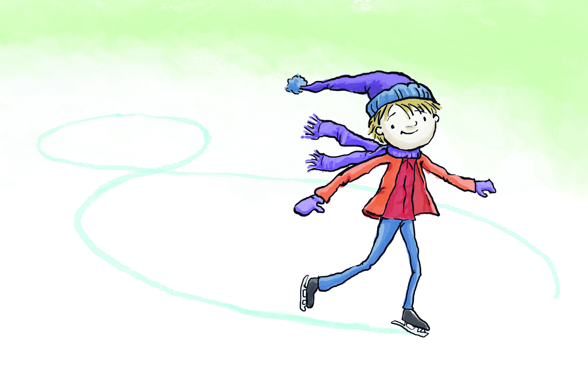

```{r setup, include=FALSE}
options(cli.progress_show_after = Inf)
options(cli.default_handler = "none")

library(learnr)
library(gradethis)
library(ergm)

knitr::opts_chunk$set(
	echo = FALSE,
	message = FALSE,
	warning = FALSE,
	cache = FALSE
)

source("../R/helper_code.R")

# Check whether required packages are installed
pkgs <- sna4tutti:::tutorial_package_requirements()

check_pkgs <- function(.pkgs = pkgs) {
  sna4tutti:::check_packages(.pkgs)
}

# RStudio
check_RStudio <- function() {
  sna4tutti::check_rstudio_equal_or_larger(verdict = TRUE)
}


# Check whether the current R version meets the package requirement
check_R <- function() {
  sna4tutti::check_r_equal_or_larger(verdict = TRUE)
}


errors <- list()
```


```{css, echo = FALSE}
.tip {
  border-radius: 10px;
  padding: 10px;
  border: 2px solid #136CB9;
  background-color: #136CB9;
  background-color: rgba(19, 108, 185, 0.1);
  color: #2C5577;
}

.warning {
  border-radius: 10px;
  padding: 10px;
  border: 2px solid #f3e2c4;
  background-color: #f3e2c4;
  background-color: rgba(243, 226, 196, 0.1);
  color: #775418;
}

.infobox {
  border-radius: 10px;
  padding: 10px;
  border: 2px solid #868e96;
  background-color: #868e96;
  background-color: rgba(134, 142, 150, 0.1);
  color: #2F4F4F;
}

# # create a horizontal scroll bar when code is too wide
# pre, code {white-space:pre !important; overflow-x:auto}
```

```{html, echo = FALSE}
<style>
pre {
  white-space: pre-wrap;
  background: #F5F5F5;
  max-width: 100%;
  overflow-x: auto;
}
</style>
```

## Introduction
Welcome to the first of three tutorials about Exponential Random Graph Models (ERGMs). We finally got here! I hope you like them because these models are super nerdy-cool!


Let's get started with the art of fitting ERGMs!

{width=75%}


## Leveling machine

As in every respectable ice rink, before skating we make sure that the ice is smooth!


### R Version 

You need a recent enough version of `r rproj()` for this tutorial.
The check below uses the minimum version required by the currently installed
`sna4tutti` package. Please hit the `Run Code` button.

```{r r_check, echo = TRUE, include = TRUE, exercise = TRUE}
check_R()
```


### R Studio Version

You need a recent enough version of RStudio for this tutorial.
The check below uses the minimum version required by the currently installed
`sna4tutti` package.
Let's check by clicking `Run Code`:

```{r rstudio_check, echo = TRUE, include = TRUE, exercise = TRUE}
check_RStudio()
```


### Packages

You need to have a few packages installed.
Click the `Run Code` button to check.
It will verify whether the required packages are installed and will tell you
which packages you need to install or update when something is missing or too old.

```{r package_check, echo = TRUE, include = TRUE, exercise = TRUE}

check_pkgs()

```


And now, take your computational enthusiasm and get ready to crunch some numbers!

{width=75%}


## Erdos Renyi

As we discussed in class, the ERGM model was not born overnight. There is a series of models that, step by step, are built on top of one another, layering in complexity. We can consider the Erdos-Renyi model as the ERGM's grandfather. AKA is one of the simplest ERG models that you can think of. It only checks the probability of observing a given network.

Let's use the Florentine families' marriage network. You should already be familiar with this one, so I won't spend more time discussing it. Instead, let's go to Florence during the Renaissance! 

{width=75%}


```{r florentine_load, include = FALSE}

florentine <- SNA4DSData::florentine
flo_mar <- florentine$flomarriage
florentine <- snafun::to_network(flo_mar)


```


```{r test_florentine_load1, results = 'markup'}

florentine <- SNA4DSData::florentine
flo_mar <- florentine$flomarriage
florentine <- snafun::to_network(flo_mar)

if (base::isFALSE(base::table((network::get.vertex.attribute(florentine, 'vertex.names')) == c("Acciaiuoli", "Albizzi", "Barbadori", "Bischeri", "Castellani", "Ginori", "Guadagni", "Lamberteschi", "Medici", "Pazzi", "Peruzzi",       "Pucci", "Ridolfi", "Salviati", "Strozzi", "Tornabuoni")) == 16)) {
  sna4tutti::broken_info()
  error <- knitr::opts_current$get(name = "label")
  errors <- base::append(errors, error)
}

```

```{r test_florentine_load2, results = 'markup'}

florentine <- SNA4DSData::florentine
flo_mar <- florentine$flomarriage
florentine <- snafun::to_network(flo_mar)

if (base::isFALSE(network::get.vertex.attribute(florentine, 'NumberPriorates')[2] == 65)) {
  sna4tutti::broken_info()
  error <- knitr::opts_current$get(name = "label")
  errors <- base::append(errors, error)
}

```


```{r test_florentine_load3, results = 'markup'}

florentine <- SNA4DSData::florentine
flo_mar <- florentine$flomarriage
florentine <- snafun::to_network(flo_mar)

if (base::isFALSE(network::get.vertex.attribute(florentine, 'NumberTies')[16] == 7)) {
  sna4tutti::broken_info()
  error <- knitr::opts_current$get(name = "label")
  errors <- base::append(errors, error)
}

```


```{r test_florentine_load4, results = 'markup'}

florentine <- SNA4DSData::florentine
flo_mar <- florentine$flomarriage
florentine <- snafun::to_network(flo_mar)

if (base::isFALSE(network::get.vertex.attribute(florentine, 'Wealth')[9] == 103)) {
  sna4tutti::broken_info()
  error <- knitr::opts_current$get(name = "label")
  errors <- base::append(errors, error)
}

```


```{r test_florentine_load5, results = 'markup'}

florentine <- SNA4DSData::florentine
flo_mar <- florentine$flomarriage
florentine <- snafun::to_network(flo_mar)

if (base::isFALSE(length(network::get.edge.attribute(florentine, 'weight')) == 20)) {
  sna4tutti::broken_info()
  error <- knitr::opts_current$get(name = "label")
  errors <- base::append(errors, error)
}

```


Let's just print the network and check its class.

```{r viewflo_mar, exercise = TRUE, exercise.setup = "florentine_load"}
florentine
class(florentine)

```


We know that we have 

* 16 nodes 
* 20 edges
* it's undirected, that it has 
* 3 nodes attributes
* 1 edge attributes (not very useful though. You can check why I say so, by running `network::get.edge.attribute(florentine, 'weight')`)

Let's also plot it just to check.

```{r plotflo_mar, exercise = TRUE, exercise.setup = "florentine_load"}
plot(florentine)
```


We already know that the network has 20 edges, right? Well, we can also double-check in another way.

By running a summary of the formula (`net ~ edges` in this case), which we will insert into the statistical model, we have a quick and straightforward way to assess the terms we introduce. 

`edges`, surprise, surprise, counts the number of edges. Any other term you insert in an ERGM formula with `summary()` will work the same way, providing the count of a certain measure inside the network you are trying to explain (your Outcome variable). This is super helpful because you can check whether the term you put into the model actually makes sense. For example, if the count gives you 0, it means it makes no sense to use that term.

TIP: It is good practice to check what is in the real network before assuming that a given term is a useful parameter in the model. Always use `summary(formula)` before running a model. You can learn important information that will make your modeling easier. 

Let's try!

```{r densityflo_mar, exercise = TRUE, exercise.setup = "florentine_load", results = 'markup'}

summary(florentine ~ edges)

```


Since we know that we have 20 of them out of N*(N-1) possible edges, we can consider this term as a proxy for density. 

Yes, they are still 20 out of 16*15 possible edges. All is good here!


Ok, let's estimate an ERG model! How? with the `ergm` package from the `statnet` suite! We are going to use mainly one function. Guess what? `ergm`!

Remember, we are testing the hypothesis that these old Italian privileged folks don't marry by chance!

TIP: always call the `ergm` function with `ergm::ergm` instead of attaching the library. 


```{r ergmflo_mar, exercise = TRUE, exercise.setup = "florentine_load"}

flomodel.01 <- ergm::ergm(florentine ~ edges)  
(s1 <- summary(flomodel.01))

```

Congrats! You run your first ERGM with an Erdos-Reyni setup! 
Here we go. Let's understand the output together. 

* The first row is the model specification: function + formula
* The second one is the model summary. AKA: the results we want.
* Then we have some measures of goodness of fit for model comparison


#### The model summary

The summary provides a list of results for the terms you entered into the model. In this case, we are only looking at the probability of the edge for formation. Hence, there is only one term: `edges`. Of course, in a more complex model, your summary will be much longer than this one. 

What do we know about each term? 

* the estimate
* the standard error
* the MCMC % 
* the z value
* the Pr(>|z|) the probability of our estimate to be larger than the z value, or P-value. 


To interpret our results, we need to focus on three of these measures:

1) The estimate or coefficient will tell us the intensity of the effect we measure. We need to apply a linear transformation to turn it into odds ratios or probabilities to better understand it.
2) The error will tell us the accuracy of our estimate. If the error is too large, we cannot trust the estimate. 
3) The p-value will tell us the chances that, by replicating a large number of networks similar to ours, we observe the same features. In this case, we are looking for the likelihood of observing 20 edges in a series of random networks generated with the same number of nodes. We want this probability to be small. 
I know it can be counterintuitive. Bear with me. If the p-value is large, it means that most networks with 16 nodes have 20 edges. This would make our Florentine family network uninteresting, since it would not be a behavior that characterizes only the marriages of these families; it would be what any random network with 16 nodes looks like. If the old Florentine dudes behave as a random network, why would we waste our time with them? We want them to be special! We want their behavior to be weird and so our p-value to be small!  


Edges is an endogenous or structural term. So again, we are just checking the probability that those 20 edges are not due to chance. Could they have been connecting any two families? In other words, do they marry randomly? Usually, people marry for a reason. Love or some other reason, but it's unlikely that they marry in a random way.

How about these old Florentine folks? Well, according to the model results, they did not marry by chance either. The P-value is < 0.0001. Hence, there is a high probability that we can reject the null hypothesis that marriage occurs by chance.
Love is not blind, and when it is the love of millionaires, it has even better sight! In fact, it is well known that in the past, rich families married each other to increase their wealth and power.

What about the coefficient? For now, without estimating odds ratios or probabilities from the coefficient, we can only say that we can interpret the sign. The negative sign means that it is unlikely that families will marry.  In general, a negative sign for edges means that the network is sparse: there is a small probability of forming links. In fact, the probability of these edges forming is 16% (we will see how to estimate this later). These old Florentine dudes don't marry by chance and don't marry that easily, either. These weddings are well thought out and kind of exclusive. It's not for every family to marry into the club! 

One more crucial thing: Look at the model summary. 
Can you see that it says: `Maximum Likelihood Results`?

Well, that's because here, you only have one dyadic independent term, and the model can be estimated without requiring MCMC chains! More about this later, but pay attention to the details already!

Finally, the variable `s1` stores the summary. It is helpful to print results in the way you like better/you need, so keep it in mind! 


#### Model comparison

You need to focus on two measures at this stage: AIC and BIC. 

These two related measures MEAN ABSOLUTELY NOTHING if you have only one model. They are helpful only in choosing the best model between two or more. 

* You always choose the model with the smallest AIC and BIC, but with the terms that interest you. 
* Don't trash a more informative model (higher number of terms) if it performs less good than a less informative one! 
* The hypothesis drives your work. If a model has a smaller AIC and BIC but does not contain the terms testing your hypotheses, you cannot select it, since your research loses meaning.

In the following tutorials, we will explore AIC and BIC for ERGMs. Feel free to ignore the Null Deviance and the Residual Deviance. 


### Simulation

We said that the Erdos-Renyi model checks the probability that our observed network differs from random others that are generated while keeping the number of nodes constant (null distribution). 

It means we are comparing our observed Florentine network with many synthetic Florentine networks simulated with the same parameters, but different, since they are random.

Still, please don't believe me blindly. Let's try it out!

Below, you can play with the Erdos-Renyi game that generates a random network with a fixed number of nodes and edges. In this small simulation, the number of nodes and edges remains constant, but the wiring is random. If in one run node A is connected to node B, in the second run, they might not be connected at all, but node C can be connected to node D. 

```{r erdos_renyi, exercise = TRUE}

plot(igraph::erdos.renyi.game(16, 20, type = 'gnm'))

```

This network we just plotted is really similar to the Florentine one, but still not quite the same. We could manually test our hypothesis by generating 1000 of these using the `igraph::erdos.renyi.game()` function and then compare the 1000 generated networks to our Florentine family one. Have you seen this in the previous classes, right? It's a CUG test!

Often, we have to compare our observed network in the absence of standard parameters (not every model has an ad hoc algorithm like the Erdos-Renyi). To do so, we can simply use the `simulate()` function in the future, which will work with any ERGM formula, even when it gets really complicated, and can test multiple hypotheses.


```{r simulate_flo, exercise = TRUE, exercise.setup = "florentine_load"}
flomodel.01 <- ergm::ergm(florentine ~ edges)
simflo <- simulate(flomodel.01, burnin = 1e+6, verbose = TRUE, seed = 9)
plot(simflo)
```

In this case, we have complete control over the parameters because we explicitly ask the function to simulate with exactly the same terms as our `flomodel.01`.

This way of simulating is not identical to the other. In this case, the simulation holds the coefficient estimated by the model fixed and allows the network features to change, for instance, the number of nodes and edges. The mechanics are different from before, but the idea is the same. This is an intuitive explanation of the math behind an ERGM that we will explore later.

Enough with this easy toy model! we are ready for something juicier!

{width=75%}


## P1

The Erdos-Renyi model is cute, but it explains reality to a very small extent. In this section, we will take a look at P1, considered ERGM's father (it's a large family...).


```{r sampson_load, include = FALSE}
SampsonIgraphtot <- SNA4DSData::Sampson

SampsonLike1Ig <-SampsonIgraphtot$Sampson_like1

sampson <- snafun::to_network(SampsonLike1Ig)
```


```{r test_sampson_load1, results = 'markup'}

SampsonIgraphtot <- SNA4DSData::Sampson

SampsonLike1Ig <-SampsonIgraphtot$Sampson_like1

sampson <- snafun::to_network(SampsonLike1Ig)

if (base::isFALSE(base::table((network::get.vertex.attribute(sampson, 'vertex.names')) == 
                  c("AMBROSE_9", "VICTOR_8", "LOUIS_11", "ALBERT_16", "BERTH_6", "SIMP_18",
                    "WINF_12", "BONAVEN_5", "GREG_2", "PETER_4", "ROMUL_10", "HUGH_14",
                    "AMAND_13", "MARK_7", "BONI_15", "JOHN_1", "BASIL_3", "ELIAS_17" )) == 18)) {
  sna4tutti::broken_info()
  error <- knitr::opts_current$get(name = "label")
  errors <- base::append(errors, error)
}

```

```{r test_sampson_load2, results = 'markup'}

SampsonIgraphtot <- SNA4DSData::Sampson

SampsonLike1Ig <-SampsonIgraphtot$Sampson_like1

sampson <- snafun::to_network(SampsonLike1Ig)

if (base::isFALSE(network::get.vertex.attribute(sampson, 'id')[2] == "0x2112a4aae00")) {
  sna4tutti::broken_info()
  error <- knitr::opts_current$get(name = "label")
  errors <- base::append(errors, error)
}

```


```{r test_sampson_load3, results = 'markup'}

SampsonIgraphtot <- SNA4DSData::Sampson

SampsonLike1Ig <-SampsonIgraphtot$Sampson_like1

sampson <- snafun::to_network(SampsonLike1Ig)

if (base::isFALSE(network::get.vertex.attribute(sampson, 'like1')[16] == "T")) {
  sna4tutti::broken_info()
  error <- knitr::opts_current$get(name = "label")
  errors <- base::append(errors, error)
}

```


```{r test_sampson_load4, results = 'markup'}

SampsonIgraphtot <- SNA4DSData::Sampson

SampsonLike1Ig <-SampsonIgraphtot$Sampson_like1

sampson <- snafun::to_network(SampsonLike1Ig)

if (base::isFALSE(base::sum(network::get.edge.attribute(sampson, 'weight')) == 110)) {
  sna4tutti::broken_info()
  error <- knitr::opts_current$get(name = "label")
  errors <- base::append(errors, error)
}

```


While the Erdos-Renyi model can be applied to both directed and undirected networks since it only considers whether there are ties (not the type of ties), the P1 checks the direction of ties and, for this reason, was designed for directed networks. 

We will now turn to the Sampson data, which you are already familiar with. 

I'm just going to remind you that it is an ethnographic study of the community structure of a New England monastery by Samuel F. Sampson.
It examines social relationships among a group of men, or novices, who were preparing to join a monastic order.


{width=40%}


Let's quickly explore it. 

```{r plotSampson, exercise = TRUE, exercise.setup = "sampson_load"}
sampson 
plot(sampson)

```

This subset of the Sampson data only considers whether the monks like each other (directional edge) or not (no edge). So we know there are 18 nodes and 88 edges forming a directed network with two attributes and no loops, in the `network` class.

The P1 model assesses the probability that the observed network is the outcome of specific, recognizable social dynamics and is therefore non-random. We hypothesize that

* Friendships between monks are motivated by specific reasons and are not random -edges formation (as the Erdos-Renyi model), 

* Monks want to be friends of other monks for specific reasons and not at random -sender of the tie, 
* Monks are chosen as friends by other  moks for specific reasons and not at ranodm - receiver of the ties 
* If a monk wants to be friend with another, the other want also to be friend with him - mutuality of the relationship.

We are going to use three new ERGM endogenous terms:

* `sender` 
* `receiver`
* `mutual`

Let's specify our model and print the results! This might take your computer a few seconds to process, so be patient. Also, aside from the model specification, there are other options specified here. Don't worry right now. We will discuss them later. Just focus on the model formula and the results at this stage.

Pay attention to the fact that, since we are inserting endogenous terms and dyadic dependent terms here (more about this later). Hence, the model is computationally more demanding, and we are using more sophisticated specifications (control ergm options). Always do that when you have endogenous terms.

```{r p1Sampson, exercise = TRUE, exercise.setup = "sampson_load"}

P1 <- ergm::ergm(sampson ~ edges + sender + receiver + mutual, 
                 control = ergm::control.ergm(MCMC.burnin = 1000,
                                              MCMC.samplesize = 5000,
                                              seed = 123456,
                                              MCMLE.maxit = 20,
                                              parallel = 2,
                                              parallel.type = "PSOCK"))

summary(P1)
```

Wow, what's this output? It's long! Well, some terms that you specify in the ERG models estimate one statistic summarizing the entire situation in your network. `edges` and `mutual` do so in this case. Other terms, such as `sender` and `receiver`, compute a statistic for every node in the network. 

That's why this output is so insanely long. When you choose the terms for your model, consider this: a result line on every node in a network with 200 or more nodes is no fun. 

`sender` and `receiver` look at the probability that every sent or received connection is non-random: If monk 2 likes monk 5, it is an entirely different situation from monk 5 liking monk 2, as much as monk 12 liking monk 18. This approach is perfect for an ethnographic study that aims to understand specific social dynamics in a small community. However, it would not be very helpful for explaining people's behavior on a network of YouTubers sending each other comments under a video that hit 2 million views (many, many nodes!!). 

Note that not every node is in the model's output, though. Node number 1 is missing. This is not a mistake. Removing one node is necessary to avoid a linear dependency between all the others. Node 1 serves as the reference category, and every other result must be compared to it. Do you remember that we discussed the reference category in the Bootcamp?


Have you noticed how much time and computational power it takes to run this very small model? That is because `mutual` is an endogenous dyadic dependent term, and the model runs an MCMC simulation for you. 


The Erdos-Renyi and the P1 models consider only structural (endogenous) effects. Also, these effects are elementary. When running these two models, we don't consider more complex network features or any attributes. But that will no longer be the case from the next section onwards. Since explaining social reality requires way more sophistication than this, let's move on to a new, fully flexible ERGM :) 


## ERGM

An ERGM (for Dutch-speaker pronunciation "eurcoom" or "eurghum") is a statistical tool for assessing causality using hypothesis testing when the outcome variable is a network. 

So far, we have fitted an Erdos-Renyi model and a P1 model. These are ERGMs, but in a ready-made specification driven by the purpose of some researchers before a fully flexible model was invented. With the `ergm::ergm` function, we can do much more by adding additional model terms according to what we need to test our hypotheses.


The ERGM is a class of models used to assess whether a network's structure and attributes are random or arise from identifiable phenomena in the world.

The observed data is compared to simulated data (as in a CUG test), so you need to ensure that your simulated data is as similar as possible to the real network (this is not possible in a CUG test). 

Think of an experiment. When you need to test a new medicine, you have a "treatment group" taking the drug and a "control group" taking a placebo. What you need is for the two groups to be as similar as possible. In fact, if they are composed of different people, you cannot know whether the medicine will work for everyone or only for people who share specific traits. 

We act using the same logic. We observe and collect data on a network we believe is relevant (treatment) and compare it with a set of simulated networks (control group). What we want is for the real and simulated networks to be as similar as possible. For this reason, we need to find the right terms to include in the ergm model so that the simulation within it can recreate synthetic networks as close as possible to the real one and make the experiment work. 

It is not easy to simulate reality. The terms you enter in the model define the simulated reality. 
If your simulated reality is too far from the real network, your model will fail (technically speaking, it will not converge). 

This is a bit complicated, right? Let's take it step by step, starting with inserting exogenous effects in the model since we haven't done that yet! 

Let's get to virtual reality! 


## ERGM Terms

An ERG model is about finding the best 'dress' to fit our data.

{width=60%}
The terms allow us to 'fit' our simulation to the observed data so that the synthetic control group is comparable (as similar as possible) to the treatment one. 

We classify the model terms in two ways: 

* Exogenous and Endogenous
* Dyadic (inter)dependent and Dyadic independent 


#### Exogenous and Endogenous

We have exogenous and endogenous model terms not only with networks but with every statistical model. Exogenous variables are the predictors assumed to be fixed and unaffected by the outcome (e.g., a person's age predicting their income), while endogenous variables are those determined within the model, such as an outcome that is itself influenced by — or feeds back into — other variables in the system (e.g., price and demand in a supply-and-demand model)

In a network model, endogenous terms are those computed from the network's own structure — they both depend on and help generate that structure through feedback (self-organization). Exogenous terms are external covariates, fixed and unaffected by the network, that influence tie formation from outside the system.

#### Dyadic (inter)dependent and Dyadic independent

We only have dyadic independent and dyadic (inter)dependent terms in network models. 

If the terms are dyadic independent, they look at the probability of tie formation independently of the surrounding network structure. For instance, two pupils in a school are friends because they are both girls (homophily). 

If a term is dyadic (inter)dependent, it considers the probability of tie formation based on other ties in the network. For instance, two pupils are friends because a common friend introduced them (triangle).

These two types of terms have implications for the math in the model you are running and your computational time. Hence, you need to be very aware of when you are using one or the other, as this can seriously affect your results. As mentioned before, when you have dyadic dependent terms, you need to use the advanced specifications in the ergm package with the control function in the model specification. Generally speaking, every well-done model needs to have dyadic dependent terms; you need to get used to the advanced specifications in the ergm package. 


#### Mixing the classifications

You will find out that these two classifications overlap. For instance, `edges` is endogenous but dyadic independent, while `mutual` is also endogenous but dyadic (inter)dependent. Hence, you need to grasp the concept and think with your own head about what is what. Isn't it less boring? I hate memorizing stuff :) 

ChatGPT disclaimer: If you are not sure about terms, refer to the ergm package 
documentation as shown below. Chat GPT or any other LLM of your choice is not necessarily up 
to date with these models and often hallucinates. If in the exam or in the project, 
you insert terms that are incorrect because you used ChatGPT or a similar tool, the 
responsibility and the consequences will be entirely on you.

## Dyadic Independent Terms

The terms we employed so far, except `mutual`, only look at independent effects since the probability of observing them does not depend on the existence of other ties but only on the properties of the individual nodes. But, even still focusing only on the effects that do not involve edge dependencies, there are many more options. We need to explore more ERGM terms. If you type in your `RStudio` console `search.ergmTerms`, it will appear in the help file. Now we focus on the dyadic independent terms
only, which you can print out using the following line of code:


```{r dyad-indepTerms, exercise = TRUE}
ergm::search.ergmTerms(search = 'dyad-independent')
```

Thirty-nine terms correspond to this description! Some of them are endogenous, but others are exogenous. 
Exogenous terms allow inserting attributes in the model. Usually, they are dyadic independent since the presence or absence of attributes should not depend on ties, but not always (hence watch out!). 

Several terms allow inserting exogenous variables (attributes) in the model.

Let's experiment with one of the most popular: `nodecov`.

```{r nodecov-search, exercise = TRUE}
ergm::search.ergmTerms(name = 'nodecov')
```

The line of code above prints out all you need to know about `nodecov`. In short, this term allows you to insert in the model the hypothesis that tie formation/absence is affected by high/low values of the attribute passed on the term. Just like a numeric variable in a regression model, right?

Let's test it with the Florentine marriage network and one of its attributes, 
wealth. Let's also assume that we are nesting models to explore our network further. Hence, we build on `flomodel.01`. Take into account that now we are playing with models
and we are not considering hypotheses, but that if you do this for real, the hypothesis
has priority over AIC and BIC.


```{r nodecovModel, exercise = TRUE, exercise.setup = "florentine_load"}
flomodel.01 <- ergm::ergm(florentine ~ edges)  

flomodel.02 <- ergm::ergm(florentine ~ edges + nodecov("Wealth"))   

texreg::screenreg(list(flomodel.01, flomodel.02))
```


In this case, it is helpful to look at AIC and BIC for model comparison
According to 

* AIC Model two is better.  
* BIC Model one and two are roughly the same, with model two a tiny bit better


The `nodecov` term's result says that it is likely that rich families marry each others.

How likely? What is the intensity of this effect? 
Again, you read the results exactly like a logit model (odds ratios)

ALERT: Check the GLM tutorial in the `Bootcamp` package if you still don't remember it. 

But, as said before, you can also estimate probabilities to interpret it.

You will see that the term `edges` is in each and every model. This is because we use it as the model intercept. 


We can also simulate `flomodel.02`.

```{r simulate_nodecov, exercise = TRUE, exercise.setup = "florentine_load"}
flomodel.02 <- ergm::ergm(florentine ~ edges + nodecov("Wealth"))  

simNodecov <- simulate(flomodel.02, burnin = 1e+6, verbose = TRUE, seed = 9)
plot(simNodecov)
```

This simulation represents our baseline random model, our control group in the experiment, and our null hypothesis. The distribution of its results is our null distribution. The simulated data originated from the same features, but does not show the remarkable qualities of our observed networks. There are families, and they marry, but randomly. 


When we use `nodecov`, we compute the correlation of a vector that expresses the number of Liras that each family owns and the edge list of the network. 

There are other ways, still in the dyadic independent universe, to check on the possibility that wealth influences marriages in old Florence. 

One term that can help us do that is `absdiff`.

```{r absdiffSearch, exercise = TRUE}
ergm::search.ergmTerms(name = 'absdiff')
```

This term computes the absolute difference between the amount of money each family owes. 

Thus, rather than checking whether being rich influences the probability of marriage in old Florence, we check the likelihood of being equally rich (or equally non-rich) influencing the marriage. 

Should we try this out? 

```{r absdiffModel1, exercise = TRUE, exercise.setup = "florentine_load"}
flomodel.01 <- ergm::ergm(florentine ~ edges)  

flomodel.02 <- ergm::ergm(florentine ~ edges + nodecov("Wealth"))   

flomodel.03 <- ergm::ergm(florentine ~ edges + absdiff("Wealth")) 


texreg::screenreg(list(flomodel.01, flomodel.02, flomodel.03))
```


From model three results, we also see that it is likely that being equally rich influences the probability of getting married to each other. 

The AIC and the BIC comparison also show that model 3 is better than the other two. 

Ok, let's nest a fourth model where we put these two terms together in the same model. Can you do this for me? 

Please re-run all of them and print them out next to each other. 


```{r absdiffModel2, exercise = TRUE, exercise.setup = "florentine_load"}


```


```{r absdiffModel2-solution}


flomodel.01 <- ergm::ergm(florentine ~ edges)  

flomodel.02 <- ergm::ergm(florentine ~ edges + nodecov("Wealth"))   

flomodel.03 <- ergm::ergm(florentine ~ edges + absdiff("Wealth")) 

flomodel.04 <- ergm::ergm(florentine ~ edges + nodecov("Wealth") + absdiff("Wealth"))   

texreg::screenreg(list(flomodel.01, flomodel.02, flomodel.03, flomodel.04))


```

```{r absdiffModel2-check}
gradethis::grade_code(correct = "Great job! I knew that you could do it!")
```


Ok, do you see that the story in model 4 has changed? This is the beauty of nesting models!

Even if our terms are significant in models two and three, they are not anymore when we combine them. Also, the AIC and BIC are higher than those in model 3.
This could be because we are trying to estimate two effects that are too similar and interfere with each other. Remember, one estimates a vector and the other a matrix, but the substantive meaning is not that different.

That's how much you can fine-tune your hypothesis using ERG models! Isn't it awesome? I answer: It is. But it is also quite challenging, and unless you know what you are doing, you will be overwhelmed by the almost unlimited options this class of model offers! 

One last thing. Can you simulate the control group of model four for me? Use `seed = 8` and a burn-in of 1e+6. We will discuss what a burn-in is next week!


```{r absdiffModel4, exercise = TRUE, exercise.setup = "florentine_load"}


```


```{r absdiffModel4-solution}


flomodel.04 <- ergm::ergm(florentine ~ edges + nodecov("Wealth") + absdiff("Wealth"))  

simNodecov <- simulate(flomodel.04, burnin = 1e+6, verbose = TRUE, seed = 8)


```

```{r absdiffModel4-check}
gradethis::grade_code(correct = "Oh yes!")
```


## Conclusion

Enough for today! Now you can go out an enjoy non-simulated reality without comparing it to a simulated null distribution... maybe...


{width=75%}


<br><br><br>

```{r check_results_external, echo=FALSE, child = if (length(errors) > 0) "check_results.Rmd"}
```
