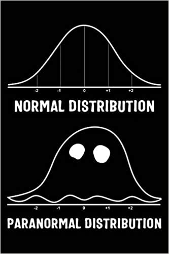
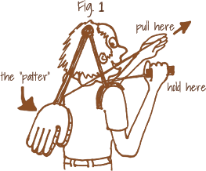

```{r setup, include=FALSE}
options(cli.progress_show_after = Inf)
options(cli.default_handler = "none")

library(learnr)
library(gradethis)
library(ergm)

knitr::opts_chunk$set(
	echo = FALSE,
	message = FALSE,
	warning = FALSE,
	cache = FALSE
)

source("../R/helper_code.R")

# Check whether required packages are installed
pkgs <- sna4tutti:::tutorial_package_requirements()

check_pkgs <- function(.pkgs = pkgs) {
  sna4tutti:::check_packages(.pkgs)
}

# RStudio
check_RStudio <- function() {
  sna4tutti::check_rstudio_equal_or_larger(verdict = TRUE)
}


# Check whether the current R version meets the package requirement
check_R <- function() {
  sna4tutti::check_r_equal_or_larger(verdict = TRUE)
}


errors <- list()

```


```{css, echo = FALSE}
.tip {
  border-radius: 10px;
  padding: 10px;
  border: 2px solid #136CB9;
  background-color: #136CB9;
  background-color: rgba(19, 108, 185, 0.1);
  color: #2C5577;
}

.warning {
  border-radius: 10px;
  padding: 10px;
  border: 2px solid #f3e2c4;
  background-color: #f3e2c4;
  background-color: rgba(243, 226, 196, 0.1);
  color: #775418;
}

.infobox {
  border-radius: 10px;
  padding: 10px;
  border: 2px solid #868e96;
  background-color: #868e96;
  background-color: rgba(134, 142, 150, 0.1);
  color: #2F4F4F;
}

# # create a horizontal scroll bar when code is too wide
# pre, code {white-space:pre !important; overflow-x:auto}
```

```{html, echo = FALSE}
<style>
pre {
  white-space: pre-wrap;
  background: #F5F5F5;
  max-width: 100%;
  overflow-x: auto;
}
</style>
```

## Introduction

Welcome to the second tutorial on Exponential Random Graph Models (ERGMs).

In the first ERGM tutorial, you learned:

* How to run an ERGM with the structural term `edges`, comparing it to an
Erdos-Renyi model
* How to simulate networks from a specified model
* How to read a model summary
* How to specify a P1 model using the dyadic independent terms `edges` 
`sender`, `receiver`, and the dyadic dependent term `mutual`
* What types of model terms you can implement in an ERG model
* How to search for terms with the function `ergm::search.ergmTerms`
* How to use and interpret the dyadic independent, exogenous terms `nodecov` and `absdiff`

In this tutorial, we build on this, improve our understanding of ERG models, and learn how to check whether the model we run has a good fit.

Let's add a new tier to our ERGM knowledge!

{width=75%}


## Ingredients check!

Before we start baking the new tier, we need to make sure we have all the ingredients for our recipe ready!


### R Version 

You need a recent enough version of `r rproj()` for this tutorial.
The check below uses the minimum version required by the currently installed
`sna4tutti` package. Please hit the `Run Code` button.

```{r r_check, echo = TRUE, include = TRUE, exercise = TRUE}
check_R()
```


### R Studio Version

You need a recent enough version of RStudio for this tutorial.
The check below uses the minimum version required by the currently installed
`sna4tutti` package.
Let's check by clicking `Run Code`:

```{r rstudio_check, echo = TRUE, include = TRUE, exercise = TRUE}
check_RStudio()
```


### Packages

You need to have a few packages installed.
Click the `Run Code` button to check.
It will verify that the required packages are installed and tell you which packages you need to install or update if any are missing or outdated.

```{r package_check, echo = TRUE, include = TRUE, exercise = TRUE}

check_pkgs()

```


Turn on the oven, we are ready for some mouth watering bun to cook!

{width=40%}


## A Dyadic independent model

In the first ERGM tutorial, we run very simple models on very small networks. 
However, very often, networks are larger than those of the Florentine or Sampson, and the relationships they map require more sophisticated explanations.

Let's take a look at the `faux.mesa.high` data set, one of the networks
included in the `ergm` package and employed in the `statnet` tutorials. Remember,
`statnet` is the project that developed the `r` package `ergm`. Their tutorials are the first place to look for information if you are running ERGMs in `r`.

The `faux.mesa.high` is modified data collected at the Mesa High School in the US.

{width=75%}


Go Rabbits! Carry On!

```{r load_mesa, include = FALSE}

data(faux.mesa.high, package = 'ergm')
mesa <- faux.mesa.high

```


```{r test_load_mesa1, results = 'markup'}

data(faux.mesa.high, package = 'ergm')
mesa <- faux.mesa.high

if (base::isFALSE(base::sum(network::get.vertex.attribute(mesa, 'Grade')) == 1790 )) {
  sna4tutti::broken_info()
  error <- knitr::opts_current$get(name = "label")
  errors <- base::append(errors, error)
}

```


```{r test_load_mesa2, results = 'markup'}

data(faux.mesa.high, package = 'ergm')
mesa <- faux.mesa.high

if (base::isFALSE(base::table(network::get.vertex.attribute(mesa, 'Race'))[2] == 109 & base::table(network::get.vertex.attribute(mesa, 'Race'))[3] == 68 )) {
  sna4tutti::broken_info()
  error <- knitr::opts_current$get(name = "label")
  errors <- base::append(errors, error)
}


```


```{r test_load_mesa3, results = 'markup'}

data(faux.mesa.high, package = 'ergm')
mesa <- faux.mesa.high

if (base::isFALSE(base::table(network::get.vertex.attribute(mesa, 'Sex'))[1] == 99 & 
            base::table(network::get.vertex.attribute(mesa, 'Sex'))[2] == 106)) {
  sna4tutti::broken_info()
  error <- knitr::opts_current$get(name = "label")
  errors <- base::append(errors, error)
}

```


Let's explore this network

```{r explore_mesa, exercise = TRUE, exercise.setup = "load_mesa"}
summary(mesa)
```

The Mesa network contains information about 203 relationships among 205 students enrolled at Mesa High School. Well, it's not entirely true. The actual information about the students is classified for privacy reasons, but we can look at something close enough. This way, we can explore the network without revealing any sensitive data. 

We have three nodal attributes: 

* Student School Grade
* Student Race
* Student Sex

Let's visually examine the network and its attributes.

```{r plot_mesa, exercise = TRUE, exercise.setup = "load_mesa"}
table(network::get.vertex.attribute(mesa, "Grade"))
plot(mesa, vertex.col = 'Grade')
legend('bottomleft', fill = 7:12,
       legend=paste('Grade', 7:12), cex = 0.75)


```

Can you do the same for the attributes Race and Sex? (Tip: don't forget to pass the names of the categories to the `legend` argument!)

```{r grade_PlotMesa, exercise = TRUE, exercise.setup = "load_mesa"}


```


```{r grade_PlotMesa-solution}

table(network::get.vertex.attribute(mesa, "Race"))
plot(mesa, vertex.col = 'Race')
legend('bottomleft', fill = 1:5,
       legend = c('Black', 'Hisp', 'NatAm', 'Other', 'White'), cex = 0.75)

table(network::get.vertex.attribute(mesa, "Sex"))
plot(mesa, vertex.col = 'Sex')
legend('bottomleft', fill = 1:2,
       legend = c('F', 'M'), cex = 0.75)


```


```{r grade_PlotMesa-check}
gradethis::grade_code(correct = "Well Done!")
```

Wonderful! You just made plots using the `network` package! Did you notice that? Quite similar to `igraph` right? Well, I hope you enjoyed the experience. For the remainder of the course, get back to `igraph` plotting! :)

Switching back to ERGMs... Carefully observe the nature of the relationships in the plots. 


Does Grade, Race, or Sex drive friendship? That's the research question we are going to answer using ERMGs!


After adding the term `edges`, which is our intercept, what comes next? 

Let's focus on Grade. This nodal attribute is categorical. Hence, we need to choose terms that can handle this typology of data. 

Since we want to know whether being in the same grade fosters friendship formation, we can use the term `nodematch`. This term deals with categorical data and examines the presence of homophilic relationships among people who share the same category (grade, in this case).

Another term that we can use with a categorical nodal attribute is`nodefactor`.
This term outputs one statistic for each category in the attribute minus one to avoid linear dependency. Each of these statistics gives the number of times a node with that attribute and that category appears in an edge in the network.

Let's run a first exploratory round.

```{r mesaErgmGrade, exercise = TRUE, exercise.setup = "load_mesa"}
mesaM1 <- ergm::ergm(mesa ~ edges +
                     nodematch('Grade', diff = TRUE) +
                     nodefactor('Grade'))
summary(mesaM1)    

snafun::stat_ef_int(mesaM1, type = "prob")
```

Every statistic in the results table allows us to reject the null hypothesis of no effects. The coefficients produced by the `nodematch` term inform us of the existence of homophilic effects in each grade. Grades 10 and 12 are the two categories in which these effects are less likely to occur. Still, the probability of observing homophily in those years is very high. The problem with these two categories is their statistical significance. Depending on the alpha level we choose, we might conclude that the effect occurred by chance. 

The `nodefactor` term indicates the probability that a given grade characterizes nodes connected to other nodes. We can say that students in grade 12 are more likely to have friends than students in other grades. We interpret it just like we would interpret a categorical variable in a logistic regression!

What happens if we try to run the same exploratory model, but focusing on race? Can you do it? Call the model 'mesaM2' and give it a go. Don't forget to print the summary and the probabilities; we are interested in the results!


```{r grade_ergmRace, exercise = TRUE, exercise.setup = "load_mesa"}


```

```{r grade_ergmRace-solution}

mesaM2 <- ergm::ergm(mesa ~ edges +
                       nodematch('Race', diff = TRUE) +
                       nodefactor('Race'))

summary(mesaM2)

snafun::stat_ef_int(mesaM2, type = "prob")


```


```{r grade_ergmRace-check}
gradethis::grade_code(correct = "Well Done!")
```


The first thing that we see when checking the `mesaM2` results table is that two of the `nodematch` coefficients are estimated at `-Inf`. Is there something wrong with the model? Let's check on its descriptive statistics. 

```{r mesaErgmRaceStats, exercise = TRUE, exercise.setup = "load_mesa"}
summary(mesa ~ edges +
          nodematch('Race', diff = TRUE) +
          nodefactor('Race'))
```

We can see that the two categories that produced the `-Inf` coefficients correspond to a 0 in the descriptive statistics table. Does it mean that we don't have any students of Black race and others in the school? 
Let's check the frequency of the nodal attribute to dig deeper.

```{r mesaErgmRaceFreq, exercise = TRUE, exercise.setup = "load_mesa"}
table(network::get.vertex.attribute(mesa, "Race"))
```

Nope! There are no empty categories in the variable. If there were empty categories, we would have had `-Inf` in the `nodefactor` results rather than the `nodematch` results, since that term checks on the likelihood of each of these categories forming friends. The zero corresponds to the homophilic cases measured by the term's formula. AKA: there are no homophilic effects for students of the `black` race and `other`. Still, even if these two categories are not empty, they are underrepresented compared to the others. Hence, with a larger sample, we might have found effects for these two as well.  


_In case one or more frequencies were empty_ we should have considered treating
this case as _missing data_ and discussed our option accordingly. However, this is NOT a missing data case. 

It's always crucial to check both the frequency of the nodal attribute and the descriptive statistics of the model specification. Only by checking both can we get the full picture and avoid mistakes, such as treating this case as a missing-data case. 

Since we don't have homophilic effects for two categories, it would be better to specify `nodematch` with `diff = FALSE`

Let's move on and check what happens with the nodal attribute Sex, still considering the same specification.


```{r mesaErgmSex, exercise = TRUE, exercise.setup = "load_mesa"}
mesaM3 <- ergm::ergm(mesa ~ edges +
                       nodematch('Sex', diff = TRUE) +
                       nodefactor('Sex', levels = -(2)))

summary(mesaM3)
snafun::stat_ef_int(mesaM3, type = "prob")

```
If you read the text output by the model (not here, but in the `r rproj()` Render tab), it says that it might be the case that 'the model is nonidentifiable.' This is a new error message introduced with `ergm 3.11`.
It indicates linear dependence between the results of these two terms. `nodematch` indicates whether there are homophilic effects due to sex, while `nodefactor` indicates the probability that female and male students make friends. In this context, homophily is more interesting; hence, since we need to remove one term to avoid linear dependence, let's discard `nodefactor`. 

Please note that I used the levels argument in this exploratory model to tell the software to compute and print the statistic for the female category rather than the male one. That's how you change your model reference category. If you do change the reference category, obviously, your output will be different. The options for changing the reference category may vary from term to term, so you need to read the manual.

After running a few exploratory models, let's try to fit a comprehensive one. 
We can keep both terms as far as Grade. 

When it comes to Race, the term looking for homophily shows two empty categories. What do we do?

The way we specified `nodematch` so far checks for _differential homophily_, which looks for homophily within each category. But it can also be specified to check overall homophily in the whole network.

As far as Race in the Mesa school, since some categories are empty, but others are not, removing the term might seem a loss of information. We can then specify the more generic option that assesses whether there is homophily overall, not informing us about each category, but providing a single statistic
for the entire network. 

Concerning the Sex attribute, let's keep differential homophily and remove the `nodefactor` term.

Let's fit the model!

```{r mesaErgmOverall, exercise = TRUE, exercise.setup = "load_mesa"}

mesaM4 <- ergm::ergm(mesa ~ edges +
                       nodematch('Grade', diff = TRUE) +
                       nodefactor('Grade') +
                       nodematch('Race', diff = FALSE) +
                       nodefactor('Race') +
                       nodematch('Sex', diff = TRUE))

summary(mesaM4)
snafun::stat_ef_int(mesaM4, type = "odds")
```


This looks like a pretty nice model! Let's comment on this model's overall meaning. 

* nodematch-grade (differential homophily): There is a homophilic effect due to grade. Students are more likely to be friends with other students in their same year. The strongest homophily is in grade 7 and the weakest in grade 12 (check the odds ratios!).

* nodefactor-grade: this term tells us the likelihood of students in each grade to make friends. Grade 12 students have the highest number of friends.

* nodematch-Race: there are homophily effects due to race. Students tend to be friends with other students of the same race.

* nodefactor-race: White students are less likely to have friends than black students, but still more likely than the other categories if compared to the reference one.

* nodematch-sex (differential homophiliy): There are homophilic effects among
female students, but not among males. Girls tend to be friends with girls, but boys tend to have both male and female friends.

Quite informative for a simple model, right? What if I tell you that we can look at even more informative model configurations? 

So far, we have explored only dyadic independent terms that examine the probability of a relationship as a function of the nodes' properties. We looked at nodal attributes, or the simple node propensity to connect to others (`edges`, `sender`, `receiver`). 

We already know that there is more than this. 

With these dyadic independent model configurations, we cannot explore situations where you meet a new friend who was in school with your roommate. We cannot explore situations where you start to follow someone on Instagram just because all your other friends do, among other examples. 

These are all important things to explore, and that's why we need to use 
dyadic dependent terms too. Also, from a more technical perspective, it is not advisable to run a network model without information about the network structure, as it cannot predict anything accurately without it. Hence, avoid running ERGMs without endogenous and dyadic dependent terms. 


## Dyadic dependent terms

We covered the conceptual difference between dyadic independence and dependence. To wrap this up: We have dyadic independence when the probability of edge formation is related to nodes' attributes; the second is related to the probability of other existing edges. 

In practice, you know when you are running a dyadic independent or dependent 
model by reading the information it prints as it runs.


```{r load_flob, include = FALSE}

florentine <- SNA4DSData::florentine
flo_bus <- florentine$flobusiness
flobusiness <- snafun::to_network(flo_bus)

```


```{r test_load_flob1, results = 'markup'}

florentine <- SNA4DSData::florentine
flo_bus <- florentine$flobusiness
flobusiness <- snafun::to_network(flo_bus)

if (base::isFALSE(base::table((network::get.vertex.attribute(flobusiness, 'vertex.names')) == c("Acciaiuoli", "Albizzi", "Barbadori", "Bischeri", "Castellani", "Ginori", "Guadagni", "Lamberteschi", "Medici", "Pazzi", "Peruzzi",       "Pucci", "Ridolfi", "Salviati", "Strozzi", "Tornabuoni")) == 16)) {
  sna4tutti::broken_info()
  error <- knitr::opts_current$get(name = "label")
  errors <- base::append(errors, error)
}

```

```{r test_load_flob2, results = 'markup'}

florentine <- SNA4DSData::florentine
flo_bus <- florentine$flobusiness
flobusiness <- snafun::to_network(flo_bus)

if (base::isFALSE(network::get.vertex.attribute(flobusiness, 'NumberPriorates')[2] == 65)) {
  sna4tutti::broken_info()
  error <- knitr::opts_current$get(name = "label")
  errors <- base::append(errors, error)
}

```


```{r test_load_flob3, results = 'markup'}

florentine <- SNA4DSData::florentine
flo_bus <- florentine$flobusiness
flobusiness <- snafun::to_network(flo_bus)

if (base::isFALSE(base::sum(network::get.vertex.attribute(flobusiness, 'NumberTies')) == 222)) {
  sna4tutti::broken_info()
  error <- knitr::opts_current$get(name = "label")
  errors <- base::append(errors, error)
}

```


```{r test_load_flob4, results = 'markup'}

florentine <- SNA4DSData::florentine
flo_bus <- florentine$flobusiness
flobusiness <- snafun::to_network(flo_bus)

if (base::isFALSE(network::get.vertex.attribute(flobusiness, 'Wealth')[9] == 103)) {
  sna4tutti::broken_info()
  error <- knitr::opts_current$get(name = "label")
  errors <- base::append(errors, error)
}

```


Let's run a dyadic independent model

```{r flob_dyad_indep, exercise = TRUE, exercise.setup = "load_flob"}

fit <- ergm::ergm(flobusiness ~ edges)
summary(fit)

```

You cannot see it in the tutorial, but if you check your `r rproj()` Render tab, you will see some text informing us that the results are estimated using maximum pseudolikelihood estimation (MPLE). 

Let's check a dyadic dependent example to compare. We can simply add the dyadic
dependent term `degree` to the previous model. This specification assesses the probability that the number of nodes with degree 1 in the Florentine business network is non-random. We care only about the output text now, though. Let's read on.

```{r flob_dyad_dep, exercise = TRUE, exercise.setup = "load_flob"}

fit <- ergm::ergm(flobusiness ~ edges + degree(1),
                  control = ergm::control.ergm(MCMC.burnin = 5000,
                                              MCMC.samplesize = 10000,
                                              seed = 123456,
                                              MCMLE.maxit = 20,
                                              parallel = 3,
                                              parallel.type = "PSOCK"))
summary(fit)

```

This text (also in the console) tells us that results are computed using Monte Carlo Markov Chains (MCMC). What does it mean? 
Dyadic dependent models cannot be estimated as the dyadic independent ones. 
They are solved using Monte Carlo Markov Chains that stochastically approximate the Maximum Likelihood. 

This means that when you have dyadic dependent terms, your model is computationally more complex. It will take longer to run, and you also need to check whether the simulation is actually doing its job correctly or if your specification is driving the model in some other directions. To check on all these things, you need to run MCMC diagnostics. 

Nitty-gritty: If you get great statistics (coefficients, p-values) next to poor MCMC diagnostic results, you can trash your model. Remember this, it is crucial!

## MCMC Dyagnostics

While solving an ERGM with MPLE as the dyadic independent model is almost the same as running Logit Models, a dyadic dependent model that uses MCMC simulations is something quite far from that. 

Conceptually, you are simulating (Monte Carlo) many networks (Markov chains) that are described and evolve according to the terms you specified. The values assumed by each parameter in the simulation are 'managed' by an algorithm (such as the Metropolis-Hastings) that helps them get closer to the observed network's values. If the estimates do not progressively get closer to the observed network's estimates, it means your model is not working as it should, resulting in a poor fit or, in the worst case, model degeneracy (yes, the model crashes). The latter indicates that the estimates do not 'converge' toward the values of the observed (actual) network.

If the terms chosen for your model were important for your dyadic independent model, they are absolutely crucial for your dyadic dependent one, since they are literally the rules that govern the world you are simulating (your Sim City). 

Your goal with dyadic dependent ERGMs is to create a synthetic reality that reproduces the social processes that generated your observed network. If you specify the model in a different direction, your synthetic reality will look very different from the observed one. Same as in a dystopian movie, where some 'wrong specification' generates unwanted consequences. 

Let's use a metaphor. You go to a fancy shop, and you buy the best cookie of your life. But it is too expensive! You can't possibly buy that cookie every day. Hence, you decide to try to recreate the recipe at home, making several attempts. 100 g of flour, 120 of sugar, 2 eggs? Or 120 of flour, 100 of sugar, and 1 egg? You try all the combinations that are most likely to taste like the original until you approximate the original cookie's flavor. Let's also say that you have a little elf who helps you a little with the job. That's what the simulations and your specifications are doing in an ERGM. 


{width=75%}


Let's take a look at what a good model fit looks like! 

### Good Fit

We rerun the model on the Florentine Business network, setting the terms `edges` and `degree` to 1. Let's observe its MCMC diagnostics. 

```{r flob_mcmc_dia, exercise = TRUE, exercise.setup = "load_flob"}

set.seed(1234)
fit <- ergm::ergm(flobusiness ~ edges + degree(1),
                  control = ergm::control.ergm(MCMC.burnin = 5000,
                                              MCMC.samplesize = 10000,
                                              seed = 123456,
                                              MCMLE.maxit = 20,
                                              parallel = 3,
                                              parallel.type = "PSOCK"))

ergm::mcmc.diagnostics(fit)

```

The `mcmc.diagnostics` function prints diagnostic information and creates simple diagnostic plots for MCMC sampled statistics produced from a fit.

In the default function, the `center` parameter is set to TRUE, meaning that the 0 represents the observed network statistics. 

The trace plots on the left-hand side show the values each parameter takes during the simulation.

The density plot on the right-hand side represents the distribution of that parameter during that simulation. 

They both need to 'develop' around zero. The trace plot should look as regular as possible, resembling a fuzzy caterpillar.

{width=75%}


The density plot should look like a normal distribution. 


{width=75%}

If we look at the MCMC diagnostics above, we see that the distribution is approximately normal and centered around zero. However, the chains are not fuzzy at all. 

This is because the model did not run long enough. Therefore, to make the simulation more stable, we need to use more advanced options in the model's configuration. 

Let me introduce you to your new best friend. Its name is `control.ergm`, and it allows you to customize the options of your simulation even further. The specification below tells the simulation to run 10000 MCMC chains and ignore the first 5000, so that we capture only the final part of the simulation, which should already be more stable. That's the burn-in. It tells the simulation to ignore the first chains (what would be on the left-hand side of the trace plot) since it might take a while for the simulation to reach a stable state.

Be careful: the burn-in needs to be smaller (typically half or 1/3) of the number of chains. If not, you are throwing away what you have inserted in your simulation. 

I am also specifying a seed inside the model so you can observe the same output I see now. Finally, I tell the model to iterate 20 times. If in 20 iterations there is no convergence, the model will be killed. 

Bonus: these models are very heavy, so it is better to use parallelization on your machines. The `parallel` parameter lets you choose the number of cores your computer uses to run the simulation in parallel. It is currently set to 3; if your computer has more, you can increase the number to make the model run faster.  

These parameters must be adjusted based on the case, but this configuration is standard and a good starting point for most models. 


```{r flob_mcmc_dia2, exercise = TRUE, exercise.setup = "load_flob"}

set.seed(1234)
fit <- ergm::ergm(flobusiness ~ edges + degree(1), 
                  control = ergm::control.ergm(MCMC.burnin = 5000,
                                              MCMC.samplesize = 10000,
                                              seed = 123456,
                                              MCMLE.maxit = 20,
                                              parallel = 3,
                                              parallel.type = "PSOCK"))

ergm::mcmc.diagnostics(fit)

```


Now we can look at the trace plots and say that 'the chains mixed well.' 

The density plot of the `degree` term is not precisely a bell curve. However, given the small sample size, it is still close enough to a normal distribution.

`mcmc.diagnostics` checks on two main issues

1 - A large portion of the sample is drawn from distributions that are significantly different from the target

2 - The size of the simulated sample is too small (our previous example)

If either of these two issues is true, you will observe a trace plot where the chains are not mixing well (non-fuzzy) and a density plot that does not look like a bell curve, and or is not centered around zero.

If you observe this, your model is not working as it should and is not simulating reality correctly.

Remember that the first issue needs you to redesign your model specification. 

In contrast, the second issue can be addressed by increasing the number of simulated networks and the burn-in. 


### Model Degeneracy

Sometimes a dyadic dependent model does _not converge_. What does it mean? 

Convergence is the process through which the MCMC chains progressively get to resemble each other until they achieve the goal of approximating the coefficient that you read in your results table.

Hence, the absence of convergence indicates that the simulation produces coefficients that progressively deviate from those in the observed (real) network. In that case, the software stops running.

If your model does not converge, it can mean two things:

1. You made an incorrect choice of model terms, since you have a wrong understanding of what characterizes your network. In that case, you need to get back to formulating new hypotheses for your data, and you need to check more carefully the descriptive statistics of your network.

2. You are using some terms that are well known for creating some convergence issues, such as `triangle`. If this is the case, you should use their geometrically weighted equivalent, which represents the same effects, and the formula has been mathematically improved to address convergence issues (the curved terms). 

In both cases, you observe the same signs of model degeneracy.
Hence, if you are not using any of the incriminated terms, you have a poor theory and a poor understanding of your network.

Let's see an example of non-convergence in the second case: the use of the `triangle` term. 
Magnolia High School network is another well-known dataset included in the `ergm` package.  

{width=75%}


```{r load_magnolia, include = FALSE}

data(faux.magnolia.high, package = "ergm")
magnolia <- faux.magnolia.high

```


```{r test_load_magnolia1, results = 'markup'}

data(faux.magnolia.high, package = "ergm")
magnolia <- faux.magnolia.high

if (base::isFALSE(base::sum(base::as.numeric(network::get.vertex.attribute(magnolia, 'vertex.names'))) == 1067991)) {
  sna4tutti::broken_info()
  error <- knitr::opts_current$get(name = "label")
  errors <- base::append(errors, error)
}

```

```{r test_load_magnolia2, results = 'markup'}

data(faux.magnolia.high, package = "ergm")
magnolia <- faux.magnolia.high

if (base::isFALSE(base::table(network::get.vertex.attribute(magnolia, 'Grade'))[2] == 210 &
            base::table(network::get.vertex.attribute(magnolia, 'Grade'))[3] == 317 &
            base::table(network::get.vertex.attribute(magnolia, 'Grade'))[6] == 193)) {
  sna4tutti::broken_info()
  error <- knitr::opts_current$get(name = "label")
  errors <- base::append(errors, error)
}

```


```{r test_load_magnolia3, results = 'markup'}

data(faux.magnolia.high, package = "ergm")
magnolia <- faux.magnolia.high

if (base::isFALSE(base::table(network::get.vertex.attribute(magnolia, 'Race'))[1] == 48  &
            base::table(network::get.vertex.attribute(magnolia, 'Race'))[2] == 261 &
            base::table(network::get.vertex.attribute(magnolia, 'Race'))[3] == 68  &
            base::table(network::get.vertex.attribute(magnolia, 'Race'))[4] == 24  &
            base::table(network::get.vertex.attribute(magnolia, 'Race'))[5] == 7   &
            base::table(network::get.vertex.attribute(magnolia, 'Race'))[6] == 1053)) {
  sna4tutti::broken_info()
  error <- knitr::opts_current$get(name = "label")
  errors <- base::append(errors, error)
}

```


```{r test_load_magnolia4, results = 'markup'}

data(faux.magnolia.high, package = "ergm")
magnolia <- faux.magnolia.high

if (base::isFALSE(base::table(network::get.vertex.attribute(magnolia, 'Sex'))[1] == 768 &
            base::table(network::get.vertex.attribute(magnolia, 'Sex'))[2] == 693)) {
  sna4tutti::broken_info()
  error <- knitr::opts_current$get(name = "label")
  errors <- base::append(errors, error)
}

```


Shall we explore the Magnolia High network? Of course, we shall!

```{r explore_magnolia, exercise = TRUE, exercise.setup = "load_magnolia"}
magnolia
```

What do we have here? 1461 nodes and 974 edges, together with 4 node attributes.

We are network experts enough to say that it is a fairly large and sparse network. Large and sparse networks often pose challenges when modeled with ERGMs. They require more sophisticated models and longer computational time. In fact, ERGMs are designed to model structure, and they do not handle it well when the structure is either very sparse or too dense. 

Why don't you try plotting it yourself to get a better overview of this network?

Together, we can move on and run a model that won't converge! How exciting! 
Remove the comment and run it to make it crash!

```{r non_convergence, exercise = TRUE, exercise.setup = "load_magnolia"}

# fit2 <- ergm::ergm(magnolia ~ edges + triangle)

```

Here it is, our lovely error message telling us we are doing something wrong!
Instead of converging, the algorithm heads off into networks that are much denser than the observed network (especially considering that our observed network is sparse!). This is such a clear indicator of a degenerate model specification that the algorithm stops after a few iterations to avoid heading off into areas that would cause memory issues.


In this case, the degeneracy is due to the `triangle` term, which has well-known serious problems and almost never works. If this happens to you, specifying other kinds of terms, you need to _rethink your theory_. 

Needless to say, don't choose your terms by chance. There are way too many possible term combinations for a model to fit by chance. When you specify a model, it must be grounded in a solid theory and a clear understanding of the descriptive statistics of the network you want to study. 


### Poor fit & more controls


Sometimes it also happens that even if your model does not degenerate and converges, providing you with results, you check the `mcmc.diagnostics`, and you see that your model does not fit your data very well. 

Let's run a simple model with the Mesa High School network. It's the exact specification we used in the previous example with the magnolia data, but we substitute the incriminated term `triangle` with `gwesp`.

When we insert `gwesp(decay=0.03, fixed = TRUE)`, we tell the model to simulate geometrically weighted edgewise shared partners instead of triangles. If you don't remember what an edgewise shared partner is, check the class notes again. As for the geometrically weighted, we are correcting for the tendency of these simulations to overconnect nodes. More specifically, each chain will estimate decay starting from the same parameter in the observed network (fixed = TRUE) and retain only the 3% of edge-wise shared partners (ESP) that the parameter generates in the simulation (you can increase or decrease this threshold). If the parameter is set to `fixed = FALSE`, we tell the model to use the parameter estimated in the previous chain as the starting value of the decay estimation in the following chain. The number you enter for decay is up to you. If you still encounter degeneracy problems, insert a smaller one. It does not really affect the results. 

There is also another new issue inserted in the control panel below. Now we are parallelizing. Your computer has several cores, but unless you ask them to help you run this model, only one will volunteer to do it for you. With the code `parallel = 3`, we tell the model to use 3 cores instead of one to increase the computational power. By also adding `parallel.type = "PSOCK"`, we tell the model to use this specific type of parallelization. Unless you know how many cores your computer has, don't change it. 

At this point, it would be helpful to check how many cores your computer has (Google how to do it). If it is more than 3, you can change the number and insert a number up to your number of cores. If it is less than 3 (which is unlikely if you are using a new computer), insert 1 or 2. 


_ALERTS:_

* THIS MODEL USES PARALLELIZATION. CHECK YOUR NUMBER OF CORES BEFORE RUNNING. 

* This model might still take a few minutes. So be patient and read the output on your RStudio in the meantime, so you see what happens with the algorithm! 

*  If it does not run at all, try to run it in your Rstudio directly. You can load the data by using `data(faux.mesa.high, package = 'ergm')` (obviously change the name in the model ^_^!) 


```{r magnolia_gwesp, exercise = TRUE, exercise.setup = "load_mesa"}

fit3 <- ergm::ergm(mesa ~ edges + gwesp(decay=0.03, fixed = TRUE), 
                   control = ergm::control.ergm(MCMC.burnin = 5000,
                                              MCMC.samplesize = 10000,
                                              seed = 123456,
                                              MCMLE.maxit = 20,
                                              parallel = 3,
                                              parallel.type = "PSOCK"))

ergm::mcmc.diagnostics(fit3)

```

As you can see, this model converges, but the diagnostics might not be the best!

In fact, there was no theory behind this model, and it has only one term. You will hardly find any model working well with such a simplistic specification. 

We should always use theory to design our model specifications after understanding the descriptive statistics of the data. That's the only way to find the appropriate recipe to explain the causal processes that generated an observed network! :)  


## Goodness of Fit

It makes no sense to use `mcmc.diagnostics()` on dyadic independent models since they do not use MCMC chains. Still, whether you are running a dyadic independent or a dyadic dependent model, you should always check whether the model you specified explains the observed network or not. You do that with the goodness of fit `gof` function from the `ergm` package.

`gof` calculates p-values for geodesic distance, degree, and reachability summaries to diagnose the goodness-of-fit of exponential family random graph models. This time, you want your p-value to be as high as possible since this p-value compares your observed data to simulated data, and if you did a good job specifying your model, the statistics that these two samples produce should be almost the same. The simulation needs to be as close to reality as possible, right?


Let's fit again the flobusiness model we already used in the section 'Good Fit' with a nice MCMC diagnostic and plot it to check whether it also has a nice goodness of fit.


```{r flob_gof, exercise = TRUE, exercise.setup = "load_flob"}

fit <- ergm::ergm(flobusiness ~ edges + degree(1),
                  control = ergm::control.ergm(MCMC.burnin = 5000,
                                              MCMC.samplesize = 10000,
                                              seed = 123456,
                                              MCMLE.maxit = 20,
                                              parallel = 3,
                                              parallel.type = "PSOCK"))
fit.gof <- ergm::gof(fit)
snafun::stat_plot_gof(fit.gof)

# If you also want to see the numeric output, uncomment below and rerun
# fit.gof


```


The output of `gof` is composed of 4 parts:

* Goodness-of-fit for degree 
* Goodness-of-fit for edgewise shared partner 
* Goodness-of-fit for minimum geodesic distance 
* Goodness-of-fit for model statistics 


The goodness of fit table for degrees has one row for each degree value in the distribution of the observed network. The column `obs` reports how many nodes with that degree are in the observed network, while the columns min, mean, and max report the simulated values for each degree value. Finally, the last column reports the p-value; as we said, we want it to be as close as possible to 1. 

The plot simply visualizes these results using box plots. The blue square and the boxplots display the simulated data, and the black tick line represents the observed values. We want the black tick line to be as close as possible to the blue squares and to stay within the min and max intervals. 

You interpret the other two remaining points analogously. 

How did this model do? While the model statistics and the minimum geodesic distance perform well, the degree does not. The simulation differs from the observed data at low degrees. However, it gets much better for higher degrees. The same happens with edgewise shared partners.

If you carefully observe, also one of the geodesic distance's values is `-Inf`, which simply indicates that there are isolates in the network. Hence, we don't have to worry about it. However, `Inf` is like an alarm that reminds you to be careful and to constantly check your actions.


Overall, the fit of this model is not great! It could be improved by adding more terms to the model and making sure to think carefully about why you put them there. 

Finally, remember that we can also check and plot the GOF in only one (or more) of these four parameters. So let's have a closer look at the degree one.

Running `gof` for the degree only also prints out the gof for the model statistics. It works the same way, and it shows how the statistics of the observed network perform in comparison to the simulated one. 

```{r flob_gofDegree, exercise = TRUE, exercise.setup = "flob_gof"}

gofdegree <- ergm::gof(fit ~ degree)

snafun::stat_plot_gof(gofdegree)
gofdegree


```

Just keep in mind that your results might differ if you analyze them one by one.

## More dyadic dependent terms

So far, we have used only a few dyadic (inter)dependent terms. There are many of them, and we cannot possibly cover every single one in this tutorial. However, it is certainly worth spending some time discussing triads, cycles, and triangles, since they are at the core of dyadic dependence and shape the formation of ties through existing ties.

### The Triad Census

Do you remember the [triad census](https://www.sciencedirect.com/science/article/pii/S0378873310000158?casa_token=FqY1CGVPJaAAAAAA:zVltTjQfyFhczdDIcwUQJmZ3zJZFGDuyrvQ0TMog7LNOOK_wADA-r46-q9bD7x7HJ2KBXFD7) categorization introduced by Davis and Leinhardt (1972)? You should have understood that checking on triads is very important in network analysis, and there are several `ergm` terms to help you with this job. 

Let's take a look at the term `triadcensus`

```{r triadcensus, exercise = TRUE}
ergm::search.ergmTerms(name = 'triadcensus')
```

If you use this term in an ERGM with a direct network, it will check on the existence of each of the 16 options and provide you with the probability of observing each of them. However, if you have an undirected network, it will not work since only a few of the 16 configurations make sense with undirected data. 

Let's try with the Sampson data we have used many times before. Please note that this is a different Sampson data set than the one used in ERGM1. Several waves of data collection were performed. While in ERGM1, there is wave 1; this is wave 2 (Monk's behavior at time 2). 


```{r sampson_load, include = FALSE}
SampsonIgraphtot <- SNA4DSData::Sampson
SampsonLike2Ig <-SampsonIgraphtot$Sampson_like2
sampson <- snafun::to_network(SampsonLike2Ig)

```


```{r test_sampson_load1, results = 'markup'}

SampsonIgraphtot <- SNA4DSData::Sampson
SampsonLike2Ig <-SampsonIgraphtot$Sampson_like2
sampson <- snafun::to_network(SampsonLike2Ig)


if (base::isFALSE(base::table((network::get.vertex.attribute(sampson, 'vertex.names')) == 
                  c("AMBROSE_9", "VICTOR_8", "LOUIS_11", "ALBERT_16", "BERTH_6", "SIMP_18",
                    "WINF_12", "BONAVEN_5", "GREG_2", "PETER_4", "ROMUL_10", "HUGH_14",
                    "AMAND_13", "MARK_7", "BONI_15", "JOHN_1", "BASIL_3", "ELIAS_17" )) == 18)) {
  sna4tutti::broken_info()
  error <- knitr::opts_current$get(name = "label")
  errors <- base::append(errors, error)
}

```

```{r test_sampson_load2, results = 'markup'}

SampsonIgraphtot <- SNA4DSData::Sampson
SampsonLike2Ig <-SampsonIgraphtot$Sampson_like2
sampson <- snafun::to_network(SampsonLike2Ig)

if (base::isFALSE(network::get.vertex.attribute(sampson, 'id')[2] == "0x2112a4aae00")) {
  sna4tutti::broken_info()
  error <- knitr::opts_current$get(name = "label")
  errors <- base::append(errors, error)
}

```


```{r test_sampson_load3, results = 'markup'}

SampsonIgraphtot <- SNA4DSData::Sampson
SampsonLike2Ig <-SampsonIgraphtot$Sampson_like2
sampson <- snafun::to_network(SampsonLike2Ig)

if (base::isFALSE(network::get.vertex.attribute(sampson, 'like2')[16] == "T")) {
  sna4tutti::broken_info()
  error <- knitr::opts_current$get(name = "label")
  errors <- append(errors, error)
}

```


```{r test_sampson_load4, results = 'markup'}

SampsonIgraphtot <- SNA4DSData::Sampson
SampsonLike2Ig <-SampsonIgraphtot$Sampson_like2
sampson <- snafun::to_network(SampsonLike2Ig)

if (base::isFALSE(base::sum(network::get.edge.attribute(sampson, 'weight')) == 111)) {
  sna4tutti::broken_info()
  error <- knitr::opts_current$get(name = "label")
  errors <- base::append(errors, error)
}

```


Since the Sampson data on monks' friendships is directed, we are checking whether these 16 configurations exist in the network.


```{r Sam_summ_triadcensus, exercise = TRUE, exercise.setup = "sampson_load"}

summary(sampson ~ edges + triadcensus)


```

Waw! In the Sampson network we observe every configuration but the 120C. 
That's a useful term indeed!

Let's run the model and see what happens.

```{r Sam_triadcensus, exercise = TRUE, exercise.setup = "sampson_load"}

samM1 <- ergm::ergm(sampson ~ edges + 
                      triadcensus, 
                    control = ergm::control.ergm(MCMC.burnin = 5000,
                                              MCMC.samplesize = 10000,
                                              seed = 123456,
                                              MCMLE.maxit = 2,
                                              parallel = 2,
                                              parallel.type = "PSOCK"))

summary(samM1)

```

The model will either not converge or take a long time to do so. I set the maximum number of iterations to 3, so it did not take too long, but you are getting weird results. Well, if you read the output, it is clear that the model isn't happy with this specification.

There is no theoretical reason that would make us think that all these effects are happening at the same time for a specific -non random- reason in this small network. Hence, the model does make sense and does not behave well. Remember, before you put a term in the model, you need to have one or more hypotheses, or it needs to make sense to include it as a control variable. Inserting 16 different configurations can hardly be justified by a hypothesis, since it involves a lot of structure to account for. Having 16 terms as a control variable is overkill. 

We might want to be more specific by choosing one or a few of these 16 possibilities, reducing the complexity of our educated guess and the model.

Checking the model summary above, we see that the configurations most represented in this sample are 012, 102, 021D, 021U, 201, and 111D. The term `intransitive` checks on three of them: 021C, 201, 111D. Let's try running it and see whether our model makes more sense this time. Pay attention, we don’t have a hypothesis, so we are introducing it as a control term.

But before that, why don't you check exactly what the term `intransitive` means and whether that might make sense, given the Sampson network's features?


```{r Sam_intransitive, exercise = TRUE, exercise.setup = "sampson_load"}

samM2 <- ergm::ergm(sampson ~ edges + intransitive, 
                    control = ergm::control.ergm(MCMC.burnin = 5000,
                                              MCMC.samplesize = 10000,
                                              seed = 123456,
                                              MCMLE.maxit = 20,
                                              parallel = 3,
                                              parallel.type = "PSOCK"))

summary(samM2)
```

This time, our results seem more interesting. Either way, you'll get an error message. Obviously, we cannot be sure since we did not check the MCMC diagnostics and the goodness of fit. If the model fit is good, what do these results mean for the Sampson network? 

We could say that it is unlikely that if two monks are friends with a third one, they are not friends with each other. They live together in the same place. It is likely that friendship triangles close. 

Can you think of other possible terms that help in the explanation of the social effects underlying the formation of these edges? Use your intuition to start formulating hypotheses and then look up the literature to support them!


But let's keep playing for now: When you want to analyze three-node patterns, other terms that might be often useful are

* `ctriple` 
* `ttriple` 
* `transitive`
* `balance`

Why don't you try to use them and see what happens with the Sampson data? TIP: not all together at the same time.

```{r Playground, exercise = TRUE, exercise.setup = "sampson_load"}

```


### Cycles
You do not only care about patterns with three nodes; you might also want to check patterns with other numbers of nodes, other motifs, and whether their edges form cycles. You do that with the `cycle` term.

For instance, in the code below, we are checking for four-node cycles in the Sampson data. First, run the code below. Afterward, change the number of nodes in the cycle. Why don't you try to think which number might be easier to observe in the Sampson data and re-run the model? Just try to analyze what you know about this network and plot it below if it helps you remember it. 

Hint: the correct number to pass to `cycle` makes that term work exactly like `mutual`!

```{r grade_cycle, exercise = TRUE, exercise.setup = "sampson_load"}

samM3 <- ergm::ergm(sampson ~ edges + cycle(4), 
                    control = ergm::control.ergm(MCMC.burnin = 5000,
                                              MCMC.samplesize = 10000,
                                              seed = 123456,
                                              MCMLE.maxit = 20,
                                              parallel = 3,
                                              parallel.type = "PSOCK"))
summary(samM3)
```

```{r grade_cycle-solution}

samM3 <- ergm::ergm(sampson ~ edges + cycle(2),
                    control = ergm::control.ergm(MCMC.burnin = 5000,
                                              MCMC.samplesize = 10000,
                                              seed = 123456,
                                              MCMLE.maxit = 20,
                                              parallel = 3,
                                              parallel.type = "PSOCK"))
summary(samM3)

```


```{r grade_cycle-check}
gradethis::grade_code(correct = "Well Done!")
```


## Simulating Specific Networks

In the first ERGM tutorial, we learned how to simulate a random network given some model specifications. For example:

```{r SamSim, exercise = TRUE, exercise.setup = "sampson_load"}

SamM <- ergm::ergm(sampson ~ edges + mutual)

SamSim <- simulate(SamM, nsim=3,  burnin = 1e+6, verbose = TRUE)

plot(SamSim[[1]])
```

But we can actually do more than this! We can also create a network from scratch and simulate a certain specific structure by setting terms to output specific coefficients. 

Let's create an undirected network with 16 nodes and a density of 0.1. 
Then let's say we want to simulate two networks that, when inserted into an ERGM model with the term `edges`, yield a coefficient of -1.8. With the term `kstar` set to two, it will output a coefficient of 0.03. 

That's how you do it!

```{r simCoef, exercise = TRUE}
g.use <- network::network(16,density=0.1,directed=FALSE)

g.sim <- simulate(~ edges + kstar(2), nsim = 2, coef = c(-1.8, 0.03),
                  basis = g.use, 
                  control = ergm::control.simulate(
                    MCMC.burnin=1000,
                    MCMC.interval=100))
g.sim[[1]]


g.simModel <- ergm::ergm(g.sim[[1]] ~ edges + kstar(2))
summary(g.simModel)
```


The results of `g.sim[[1]]` and `g.simModel`, will vary each time since this is a simulation, but they will always be quite close to the values we set with `coef = c(-1.8, 0.03)`.

That's how the faux mesa and the faux magnolia data were created! In fact, Faux means fake :)

## Get your hands dirty!

At this point, we covered together every essential topic that you need to know in order to be able to run unimodal non-weighted exponential random graph models. 

Do you still feel a bit shaky at the idea of running these models? Of course you do! What you do need now is practice, and no class can make up for that! 

Hence, this tutorial concludes with a guided, practical task to gain familiarity with ERGMs. 

For this task, we will use the UK faculty data from the `igraphdata` package. You already used it for one of  the homeplays. Still, let's pretend that you spent one year of your time collecting this data on these British academics, and now you are looking forward to understanding a bit better what is going on with your sample.

You always start by understanding your data. Let's take a look.

```{r load_UKfaculty, include = FALSE}

data(UKfaculty, package = "igraphdata")
UKF <- UKfaculty
```


```{r test_load_UKfaculty1, results = 'markup'}

data(UKfaculty, package = "igraphdata")
UKF <- UKfaculty

if (base::isFALSE(igraph::get.graph.attribute(UKF, 'Type') == "TSPE" &
            igraph::get.graph.attribute(UKF, 'Date') == "Mon Mar 19 21:56:02 2007" &
            igraph::get.graph.attribute(UKF, 'Citation') == "Nepusz T., Petroczi A., Negyessy L., Bazso F.: Fuzzy communities and the concept of bridgeness in complex networks. Physical Review E, 77:016107, 2008." &
            igraph::get.graph.attribute(UKF, 'Author') == "Nepusz T., Petroczi A., Negyessy L., Bazso F.")) {
  sna4tutti::broken_info()
  error <- knitr::opts_current$get(name = "label")
  errors <- base::append(errors, error)
}

```

```{r test_load_UKfaculty2, results = 'markup'}

data(UKfaculty, package = "igraphdata")
UKF <- UKfaculty

if (base::isFALSE(base::sum(igraph::get.vertex.attribute(UKF, 'Group')) == 152)) {
  sna4tutti::broken_info()
  error <- knitr::opts_current$get(name = "label")
  errors <- base::append(errors, error)
}

```


```{r test_load_UKfaculty3, results = 'markup'}

data(UKfaculty, package = "igraphdata")
UKF <- UKfaculty

if (base::isFALSE(base::sum(igraph::get.edge.attribute(UKF, 'weight')) == 3730)) {
  sna4tutti::broken_info()
  error <- knitr::opts_current$get(name = "label")
  errors <- base::append(errors, error)
}

```


```{r exploreUKF, exercise = TRUE, exercise.setup = "load_UKfaculty"}

UKF

igraph::V(UKF)$Group # school
```

So we know that this network is stored in `igraph` format and that we have one nodal attribute `Group`. There are 81 nodes and 817 edges, and the network is directed.

Let's visualize it (one more time)


```{r plotUKF, exercise = TRUE, exercise.setup = "load_UKfaculty"}

plot(UKfaculty,
     vertex.shape="circle",
     vertex.label = NA,
     vertex.color = igraph::V(UKfaculty)$Group,
     edge.width = igraph::E(UKfaculty)$weight*0.5,
     edge.arrow.size = 0.1,
     layout = igraph::layout.fruchterman.reingold,
     main= "Homophilic behavior by group")


```

Ok, from the plot we can see that these British academics are coming from four different groups, let's say University departments, and some of them are friends with each other across groups since they usually dine at the university canteen. 

We want to know more, don't we? Let's take a look at the centrality plots!


```{r UKFcentrality, exercise = TRUE, exercise.setup = "load_UKfaculty"}

snafun::plot_centralities(UKF)
```

How do you interpret this result? 

Which other exploratory analysis do you think you should run, considering what you already know about this network? 


After we have a clear idea of what we are dealing with (and have read extensively relevant literature on friendship networks), it is time to ask ourselves a research question and formulate some hypotheses.

Q: What characterizes this friendship network? 

H1: Friendship relationships are reciprocal

H2: There are groups of friends in this network

H3: People belonging to the same group are more likely to be friends  


Let's try to translate our expectations into ERGM terms!

If we want to check whether relationships are reciprocated, we can use the term `mutual` (or `cycle(2)`). Shall we run it?


```{r Model1, exercise = TRUE, exercise.setup = "load_UKfaculty"}

UKFN <- snafun::to_network(UKF)

UKFit.1 <- ergm::ergm(UKFN ~ edges + cycle(2), 
                      control = ergm::control.ergm(MCMC.burnin = 5000,
                                              MCMC.samplesize = 10000,
                                              seed = 123456,
                                              MCMLE.maxit = 20,
                                              parallel = 3,
                                              parallel.type = "PSOCK"))

summary(UKFit.1)
```

And we were right! It seems that something is interesting here. Do you want to try to run it again using `mutual` instead?

Let's add one or more terms to test whether there are groups of friends in the network. How many friends do we expect to find? Let's try with `triangles` and take into account that this model might take a while... or forever :S


```{r Model2, exercise = TRUE, exercise.setup = "load_UKfaculty"}

UKFN <- snafun::to_network(UKF)

UKFit.2 <- ergm::ergm(UKFN ~ edges + cycle(2) + triangle, 
                      control = ergm::control.ergm(MCMC.burnin = 5000,
                                              MCMC.samplesize = 10000,
                                              seed = 123456,
                                              MCMLE.maxit = 1,
                                              parallel = 3,
                                              parallel.type = "PSOCK"))

summary(UKFit.2)
```

Ouch, we used `tringles`, but do you remember that this term has convergence issues? In fact, it will not converge (increase the number of iterations if you don't believe me). Why don't you re-run it using the curved term alternative (gwesp - see documentation to learn how)?

Let's focus on our third hypothesis. We can do that by checking for homophily, considering the group a nodal attribute. We want to assess the probability of homophilic effects in each group. Hence, we should check for differential homophily. 

```{r Model3, exercise = TRUE, exercise.setup = "load_UKfaculty"}
UKFN <- snafun::to_network(UKF)

UKFit.3 <- ergm::ergm(UKFN ~ edges + cycle(2) + nodematch('Group', diff = TRUE), 
                      control = ergm::control.ergm(MCMC.burnin = 5000,
                                              MCMC.samplesize = 10000,
                                              seed = 123456,
                                              MCMLE.maxit = 20,
                                              parallel = 3,
                                              parallel.type = "PSOCK"))

summary(UKFit.3)
```

It seems we were right in a certain way, but group four has an odd result! We should have checked the model's descriptive statistics before! Shame on us! ;)
Why don't you do it now? 

Ok, let's wrap up what we found out and what we know so far. Remember to insert a curved term replacing `triangles` to improve convergence!

[insert two more terms in the model]


```{r grade_model4, exercise = TRUE, exercise.setup = "load_UKfaculty"}
UKFN <- snafun::to_network(UKF)
UKFit.4 <- ergm::ergm(UKFN ~ edges + 
                        mutual, 
                      control = ergm::control.ergm(MCMC.burnin = 5000,
                                              MCMC.samplesize = 10000,
                                              seed = 123456,
                                              MCMLE.maxit = 20,
                                              parallel = 3,
                                              parallel.type = "PSOCK"))

summary(UKFit.4)

```


```{r grade_model4-solution}
UKFN <- snafun::to_network(UKF)
UKFit.4 <- ergm::ergm(UKFN ~ edges + 
                        mutual + 
                        nodematch('Group') +
                        gwesp(0.25, fixed = T),
                      control = ergm::control.ergm(MCMC.burnin = 5000,
                                              MCMC.samplesize = 10000,
                                              seed = 123456,
                                              MCMLE.maxit = 20,
                                              parallel = 3,
                                              parallel.type = "PSOCK"))

summary(UKFit.4)

```


```{r grade_model4-check}
gradethis::grade_code(correct = "Well Done!")
```


Well done! How else can we improve this model? Why don't you try a few more options? 


```{r PlaygroundModel, exercise = TRUE, exercise.setup = "load_UKfaculty"}


```


Ok, have you decided on your favorite configuration? Yes? Let's move on to check the goodness of fit. Substitute the model below with your best one and run `mcmc.diagnostics`.

```{r UKFBestModel, exercise = TRUE, exercise.setup = "load_UKfaculty"}
UKFN <- snafun::to_network(UKF)
UKFit <- ergm::ergm(UKFN ~ edges + mutual,
                      control = ergm::control.ergm(MCMC.burnin = 5000,
                                              MCMC.samplesize = 10000,
                                              seed = 123456,
                                              MCMLE.maxit = 20,
                                              parallel = 3,
                                              parallel.type = "PSOCK"))
ergm::mcmc.diagnostics(UKFit)


```


What is the MCMC diagnostics telling you? Is your model good? Shall you spend some more time changing terms to improve the fit?


If and only if your MCMC diagnostics are good enough, you can move on to the goodness-of-fit.


```{r UKFBestModelgof, exercise = TRUE, exercise.setup = "load_UKfaculty"}
UKFN <- snafun::to_network(UKF)
UKFit <- ergm::ergm(UKFN ~ edges + mutual,
                    control = ergm::control.ergm(MCMC.burnin = 5000,
                                              MCMC.samplesize = 10000,
                                              seed = 123456,
                                              MCMLE.maxit = 20,
                                              parallel = 3,
                                              parallel.type = "PSOCK"))

UKgof <- ergm::gof(UKFit)

snafun::stat_plot_gof(UKgof)

```


What is the `gof` telling you? Is the model good? 

If it's not, you have to go back and try to specify different terms. If and only if it's good enough, you can plot the results again and comment on them!

Again, copy and paste your best model below and comment on the results.

```{r UKFBestModelres, exercise = TRUE, exercise.setup = "load_UKfaculty"}

```
 

Final note: to make the tutorial run faster, the MCMC burn-in and sample size have been set to very low values. To improve the model (and diagnostics), remember to increase these numbers in a real, final version of the data analysis.

## Conclusion

It’s great that you got to the end of this tutorial. It wasn’t an easy journey, and you should pat yourself on the back!


{width=75%}

Now you should have got enough training to be able to go out and run your first 'real' exponential random graph model!

Good luck and keep up the good work!


<br><br><br>

```{r check_results_external, echo=FALSE, child = if (length(errors) > 0) "check_results.Rmd"}
```
